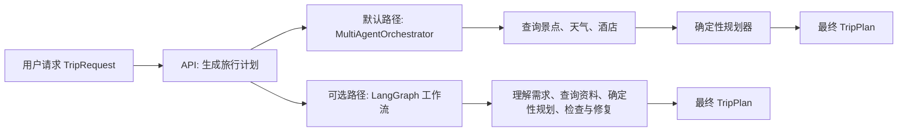
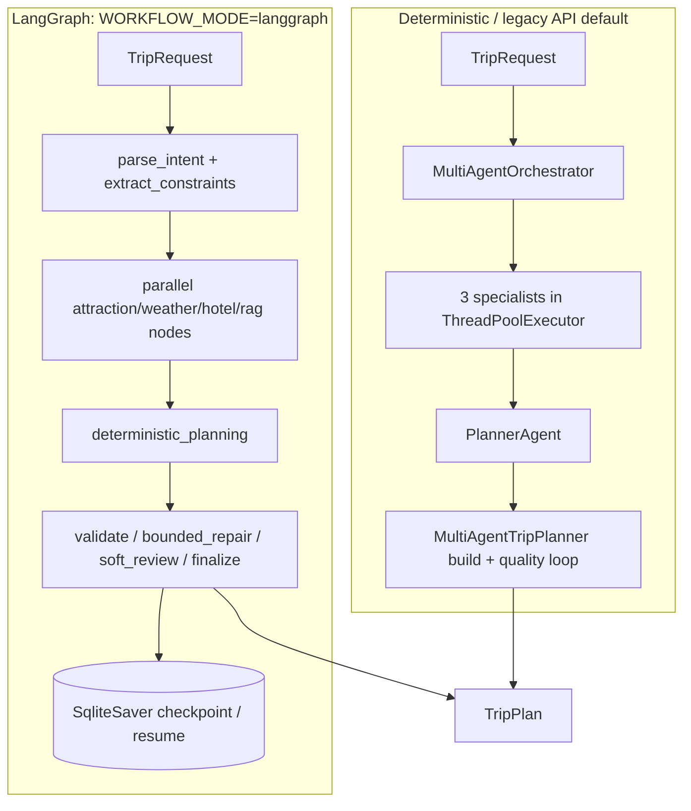
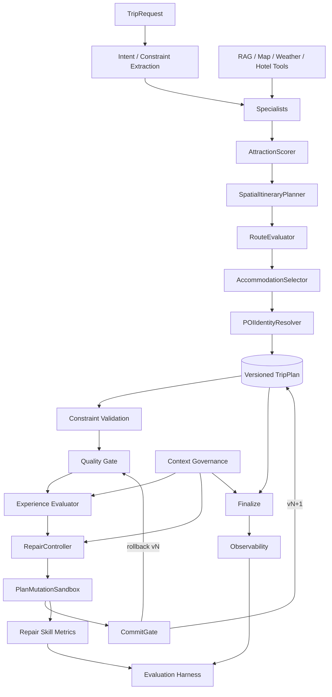
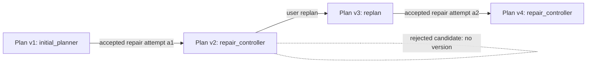
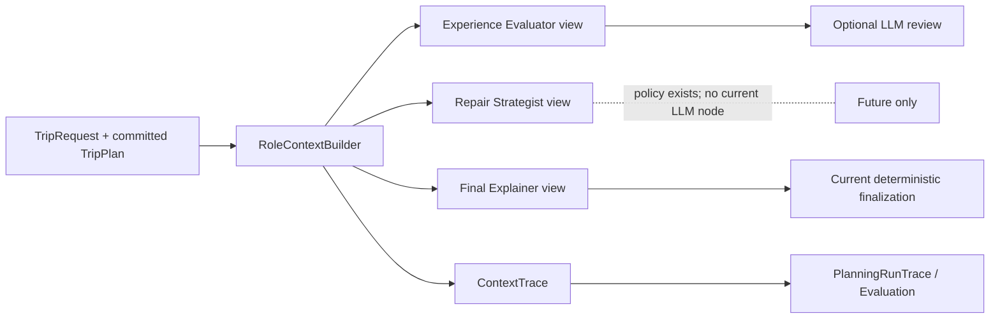
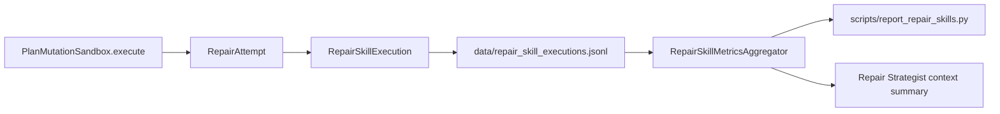
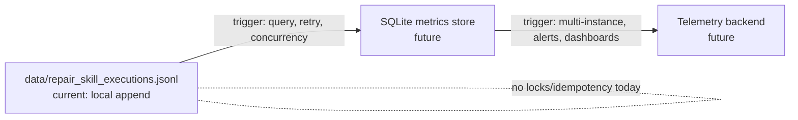

# 旅行助手：架构与设计决策报告

> 调查基线：仓库 `backend`；2026-07-31。本文以实际代码为准，不把设想当作已实现能力。验证命令：`python -m unittest discover -s tests -v`，结果为 **151 tests, OK**。配置默认 `workflow_mode="legacy"`（`app/config.py`），因此 LangGraph 是已接线、可选的工作流，而不是当前 API 默认路径。

## Executive Summary

这是一个以 `TripPlan` 为中心的混合规划系统：LLM 与工具主要增加意图理解、候选召回与体验审查能力；路线、预算、时间、POI 去重和硬约束由确定性组件计算和验证。计划修复不能直接改正式对象，必须经过 `RepairController → PlanMutationSandbox → CommitGate`，成功后才从 vN 变为 vN+1。该边界让系统在 LLM、地图或 RAG 不可用时仍能返回可解释的 deterministic/best-effort 结果。

最值得警惕的现实边界是：API 默认仍是 legacy orchestrator；LangGraph 虽已实现 checkpoint/resume，但不是默认；`FINAL_EXPLAINER` 与 `REPAIR_STRATEGIST` 目前是 context policy/trace 边界，未形成独立 LLM 节点；Repair Skill metrics 为无锁、无幂等的 JSONL，不是生产遥测库。

## 术语表

| 术语 | 本项目中的准确含义 |
|---|---|
| LLM judgment | specialist、free-text supplement 或 `PlannerAgent` 对软体验提出的结构化观察；不是硬约束裁决。 |
| deterministic validation | `ConstraintValidationEngine`、legacy `ConstraintChecker`、`ItineraryCompletenessGate` 与重算逻辑。 |
| mutation | 对 sandbox candidate 的受限 handler 操作；不能直接变成正式计划。 |
| commit | `PlanMutationSandbox.execute()` 接受 `CommitGate.decide()` 后生成 vN+1 的时刻。 |
| persistence | LangGraph SQLite checkpoint、会话 SQLite、Repair Skill JSONL 分属不同用途和一致性边界。 |
| observability | `PlanningRunTrace`、`ContextTrace`、`RepairAttempt`、JSON log 与 evaluation report。 |
| StructuredIssue | 提示中名称；代码实际类型是 `ExperienceIssue`，承担同一结构化 issue 职责。 |

## 0. 阅读地图：入口、状态与真实调用链

### 入口

先把它理解为一个“旅行计划加工厂”：用户提交需求，系统找景点、天气和酒店，再用固定算法排出每天的行程；LLM 只负责补充信息和检查体验，不能直接改最终计划。

- HTTP 入口在 `app/api/routes/trip.py` 的 `plan_trip()`。它收到 `TripRequest`（用户的城市、天数、预算、必去景点等）。
- 正常情况下（配置默认 `legacy`），它调用 `MultiAgentOrchestrator.plan_trip()`；如果配置改为 `langgraph`，才调用 `LangGraphTripWorkflow.run()`。
- 用户要求“重新规划”时，`replan_trip()` 会调用 `MultiAgentTripPlanner.replan()`：复制旧计划、重新计算路线和预算，再检查能不能执行。
- 命令行评估入口是 `scripts/run_evaluation.py`，用来批量检查不同旅行需求是否都能得到合格计划；它默认只跑确定性规划，不依赖外部 LLM。

### 三条计划链路



**确定性规划器在做什么？** `MultiAgentTripPlanner.plan_trip()` 先收集候选景点，再选酒店、查本地旅行攻略。`build_plan_from_inputs()` 给景点评分、按距离把它们分到不同天、计算路线、步行距离和预算。最后再检查预算、步行、结束时间、必去景点等规则。这部分不依赖 LLM，所以可离线运行、结果也更稳定。

**默认的 legacy 路径在做什么？** `MultiAgentOrchestrator.plan_trip()` 会同时启动三个小助手：找景点、查天气、找酒店。然后 `PlannerAgent.run()` 把这些结果交给确定性规划器。如果 LLM 给出的信息导致硬约束不满足，系统会改用 `MultiAgentTripPlanner.plan_trip()` 重建，不会让 LLM 的结果直接决定最终计划。这里的 legacy 意思是“为了兼容现有 API 保留的路径”，不是“废弃代码”；它现在就是默认路径。

**LangGraph 路径在做什么？** `LangGraphTripWorkflow._build_graph()` 把流程拆成多个可保存进度的小步骤：理解需求、提取约束、并行查景点/天气/酒店/RAG、确定性规划、检查、必要时修复、最后整理输出。它的优点是中断后可以恢复；但真正排路线的仍是同一个确定性规划器。修复最多尝试 3 次。



**重新规划和恢复。** `MultiAgentTripPlanner.replan()` 不会直接改旧计划，而是先复制一份，再重新计算；这样旧版本还在。`LangGraphTripWorkflow.resume(thread_id)` 可以从 `data/langgraph_checkpoints.db` 继续上次中断的位置。checkpoint 会保存请求、已经查到的资料、当前已提交计划、版本号、修复摘要和错误信息；不会保存“正在尝试、还没有通过检查的候选计划”。

**最后输出。** `LangGraphTripWorkflow.finalize()` 只整理提示和失败原因，不再改路线。如果计划仍有不能解决的硬问题，API 仍会返回一份 best-effort 计划和原因，告诉前端它不能算作可直接执行的计划。

### 主要模型

`TripRequest`（`app/models/schemas.py`）同时承载表单字段、预算/步行/必去/规避类别、旅伴、时窗、显式 hard/soft constraints。`TripPlan` 由 `DayPlan`（每日 POI `Attraction`、`Hotel`、`Meal`、`RouteSegment`、时段与日级距离/时间/成本）、`Budget`、两种约束结果、证据、质量与版本字段组成。`Attraction.visit_key` 由 `POIIdentityResolver` 统一，防止父子 POI/别名重复；`RouteSegment` 含 mode、距离、行程与步行分量。

质量契约在 `app/models/quality.py`：代码实际模型名为 **`ExperienceIssue`**（不是 `StructuredIssue`），字段有 `issue_type`、`severity`、day、evidence、`repair_strategy`、canonical fingerprint 和来源；`ExperienceEvaluation` 有 `pass`、0–10 分、issues、source/contract errors；`RepairAttempt` 保存 sandbox 前后 validation/quality、`PlanDiff`、状态、回滚原因；`PlanVersionMetadata` 保存 version、parent、source、action、reason、attempt。`ValidationResult` 位于 `app/constraints/schema.py`，含 typed `ValidationViolation`、已检查约束数与分数。

Repair Skill 模型为 `RepairSkillDefinition`（只读能力描述）及 `RepairSkillExecution`（一次选择到提交的紧凑事件）。Context 模型为 `ContextPolicy`、`GovernedContext`、`ContextTrace` 与 `ContextRole`。LangGraph 的 `PlanningState` 是可序列化 `TypedDict`，而节点边界的 `TravelIntent`、`PlanningDraft`、`FreeTextIntentSupplement` 是 Pydantic。

### 总体架构



LLM 目前用于 specialist 的结构化召回/天气/酒店结果、自由文本意图补充和可选 Experience review；它不排路线、不算预算、不直接写正式计划。确定性算法做候选评分、地理分组、排序、路线/预算/时间重算和酒店选择。Validator 是硬约束的裁决者；Repair 是受 scope 约束的候选修改与提交协议；Context Governance 是 prompt 的可见性边界；Observability/Evaluation 则将选择理由、结果和回归变成可检查数据。因此这不是“纯 LLM 写一段行程文字”，而是“LLM 辅助理解/审查 + 确定性求解/验证 + 事务式修复”的混合系统。

## 1. 当前原则（代码锚点与现实问题）

1. **理解、审查归 LLM，执行归确定性组件。** `PlannerAgent.run` 先 `build_plan_from_inputs`，再 `review_plan`；避免模型算错路线或在失败时整条 API 失败。
2. **hard constraint 由 validator 裁决。** `ConstraintValidationEngine.validate` 和 legacy `ConstraintChecker.check`，处理预算、步行、时窗、活动、覆盖；自然语言“看似合理”不可审计。
3. **LLM 以 Structured Output 协作。** `parse_agent_result(..., ExperienceEvaluation)`，issue 通过 enum `RepairStrategy` 指向 handler；自由文字不能安全驱动 mutation。
4. **修复先 candidate 后正式状态。** `PlanMutationSandbox.execute` 的 `model_copy(deep=True)`、重算、验证、gate，解决嵌套对象误改。
5. **CommitGate 是 repair 的唯一正式版本转换点。** `PlanMutationSandbox` 接受后才写 `PlanVersionMetadata(vN+1)`；handler 只有 mutate 权限。
6. **正式计划变更具 lineage。** `TripPlan.plan_version` 与 `RepairAttempt/PlanDiff` 能关联重现；replan 显式建立新 parent。
7. **Context Governance 只限制模型视野。** `RoleContextBuilder` 只生成 payload/trace，绝不修改 request/plan；测试验证不变性。
8. **Observability/Evaluation 是产品契约。** `PlanningRunTrace`、`EvaluationHarness`、JSONL skill 事件支持解释和回归，而非普通 debug log。
9. **RAG 给证据，不给路线决定权。** `TravelGuideRAG.search` 输出 `EvidenceSource`；路线仍由 scorer/planner/validator 计算。
10. **工具结果是候选/输入，不是模型可任意改写的事实。** AMap 工具输出经 typed specialists、候选覆盖与确定性重建；`MultiAgentOrchestrator` 的 hard-constraint fallback 是最后防线。

中译中：
1. **LLM 不直接做最终规划，只负责理解和审查**

用户说“我想去北京玩三天，预算 3000，不想走太多路”，LLM 可以负责理解这些需求，也可以帮忙审查计划哪里不合理。

但真正生成路线、算预算、算步行距离、排时间表的，不交给 LLM，而是交给确定性组件。

所以 `PlannerAgent.run` 的流程是：

先用代码 `build_plan_from_inputs` 生成计划，再让 LLM `review_plan` 检查。

这样做是为了避免 LLM 算错路线、算错时间，或者 LLM 失败时导致整个 API 直接挂掉。

2. **硬性约束必须由代码检查，不能靠 LLM 说“看起来合理”**

比如这些要求：

预算不能超；
每天步行不能太多；
景点开放时间要对得上；
活动不能冲突；
用户指定的地方要覆盖到。

这些都属于 hard constraint，也就是“必须满足”的硬约束。

它们要由 `ConstraintValidationEngine.validate` 或旧版的 `ConstraintChecker.check` 来检查。

不能让 LLM 说一句“这个计划看起来合理”，因为自然语言没法审计，也没法稳定复现。

3. **LLM 输出必须是结构化结果，不能靠自由文本驱动修改**

LLM 可以说哪里有问题，但必须按固定格式说。

比如 `parse_agent_result(..., ExperienceEvaluation)` 会把 LLM 的输出解析成结构化对象。

如果发现问题，`issue` 不能只是写一句“今天太累了”，而要通过 enum，比如 `RepairStrategy`，明确指向某种修复策略。

例如：

减少步行；
替换景点；
调整顺序；
压缩活动；
重新规划某一天。

这样 handler 才知道应该执行哪个安全的修复逻辑。

不能让 LLM 随便写一段自由文字，然后系统就根据这段话直接改计划，因为这样很危险，也不可控。


4. **修复计划时，先在副本里试改，不能直接改正式计划**

`PlanMutationSandbox.execute` 的意思是：

先用 `model_copy(deep=True)` 复制一份计划；
在副本上尝试修改；
重新计算路线、时间、预算等；
重新验证约束；
通过 gate 检查；
最后才决定要不要接受。

这样可以避免修复过程中不小心把正式计划里的嵌套对象改坏。


5. **CommitGate 是唯一能把修复结果写成正式版本的地方**

handler 只能负责“怎么改”，但不能负责“正式提交”。

也就是说，某个 repair handler 可以在沙盒里改计划，但它没有权力直接把结果变成正式版本。

只有 `CommitGate` 判断修复结果通过后，`PlanMutationSandbox` 才会写入新的 `PlanVersionMetadata(vN+1)`。

这保证了正式计划的版本变更只有一个入口，不会到处都能偷偷改。


6. **每次正式计划变更都要能追溯**

`TripPlan.plan_version`、`RepairAttempt`、`PlanDiff` 这些东西的作用是记录：

这是第几个版本；
为什么改；
谁触发的修复；
修复了什么；
和上一个版本有什么差异；
如果是重新规划，它的 parent 是哪个版本。

这样以后出问题时可以复现和追责。


7. **Context Governance 只控制 LLM 能看到什么，不修改真实数据**

`RoleContextBuilder` 的职责只是给不同角色的 LLM 生成不同上下文。

比如审查预算的 LLM 只看预算相关信息；
审查体验的 LLM 只看行程节奏和用户偏好；
审查交通的 LLM 只看路线和时间。

但它只能生成 `payload` 和 `trace`，不能修改 `request` 或 `plan`。

测试里也要验证：经过 context builder 之后，原始请求和计划没有被改动。


8. **可观测性和评估不是普通 debug log，而是产品能力的一部分**

`PlanningRunTrace`、`EvaluationHarness`、JSONL skill 事件，不只是给开发排查问题用的日志。

它们是系统产品契约的一部分，用来支持：

解释为什么生成这个计划；
回放一次规划过程；
比较不同版本效果；
做回归测试；
发现某次改代码后规划质量有没有下降。


9. **RAG 只提供证据，不负责决定路线**

`TravelGuideRAG.search` 可以查资料，比如：

某景点开放时间；
某餐厅特色；
某区域适合亲子；
某景点近期是否维修；
攻略里推荐的游玩时长。

这些结果会作为 `EvidenceSource`。

但路线怎么排、时间怎么分配、是否满足约束，仍然由 scorer、planner、validator 这些确定性组件决定。

也就是说，RAG 只是提供参考资料，不直接拍板。


10. **外部工具结果只是输入候选，不是 LLM 可以随便改写的事实**

比如 AMap 工具返回了一些地点、距离、路线、候选 POI。

这些结果要经过 typed specialists、候选覆盖、确定性重建等流程处理。

LLM 不能随便把工具结果改写成“我觉得这个地方更近”或者“应该能走到”。

如果前面的智能体协作没处理好，`MultiAgentOrchestrator` 里的 hard-constraint fallback 是最后一道防线，用来兜底检查硬约束。


## 2. ADR-001：为什么不让 LLM 直接修改 TripPlan

**问题背景。** LLM 可以判断“第 2 天偏空”，但完整 `TripPlan` 同时有 POI identity、route segments、day metrics、budget、validation、weather backup 和版本关系；自然语言或不完整 JSON 很容易漏字段且结果不稳定。

**当前实现。** 模型返回 `ExperienceEvaluation/ExperienceIssue`，而不是计划 patch；`PlannerAgent.review_plan` 解析后把 issue 交给 `MultiAgentTripPlanner.run_quality_loop`。`RepairController` 根据 strategy 选择确定性 handler，sandbox 再提交。

**真实调用链。** `PlannerAgent.evaluate_experience → parse_agent_result(ExperienceEvaluation) → run_quality_loop → RepairController.propose/apply_to_candidate → PlanMutationSandbox.execute → _recalculate → CommitGate.decide`。

**为什么这样设计。** 例如 LLM 对 `underfilled_day` 建议“加一个 POI”：直接 `day.attractions.append()` 会遗漏 `visit_key` 去重、路线重排、出/返酒店腿、步行/交通/结束时间、预算、opening-hours 与 `primary_plan`。当前策略 `ADD_NEARBY_COMPLEMENTARY_POI` 只在已有候选中选择，随后全量重算和验证。

**没有采用的替代方案。** 完整 LLM `TripPlan` JSON：覆盖面大但最脆弱；JSON Patch：字段粒度更小但仍不能证明派生字段一致；function calling mutation tool：调用更受控但工具若直改正式 state 仍危险；生成代码改计划：审计/安全面更差。当前受约束 handler 牺牲开放性，换取可验证性。

**主要收益。** 可重复、可测、可审计；LLM 失败保留原计划。**成本与复杂度。** 必须维护 issue→strategy→handler 映射和候选池，未知偏好不一定能修。**失败模式。** 模型给非法 strategy、语义不当 issue 或无可用候选。**当前防护措施。** Pydantic enum、registry applicability、scope gate、validator、rollback；非法 strategy 记录 contract error。**测试与证据。** `test_structured_llm_issue_triggers_real_repair`、`test_llm_review_can_explain_but_not_replace_plan_structure`。**当前限制。** issue schema 合法不代表语义正确。**未来演进条件。** 先为新 issue 建离线样本、handler、validator 和回放测试。**面试表达。** “模型只提出结构化意图；状态变更由确定性事务执行，这把生成不确定性隔离在建议层。”

翻译：我们不让 LLM 直接改计划，因为 TripPlan 是复杂状态对象。LLM 只负责发现问题，并用结构化 enum 表达修复意图。真正修改由受控 handler 在 sandbox 里完成，改完后全量重算、validator 校验，再由 CommitGate 决定是否提交成新版本。这样可以避免 LLM 漏字段、破坏派生数据或污染正式计划，同时保留可测试、可回滚和可审计能力

## 3. ADR-002：为什么使用 Plan Mutation Sandbox

**问题背景。** repair handler 操作深层 `days[].attractions/route_segments`，共享引用会让失败尝试污染正式计划。**当前实现。** `PlanMutationSandbox.execute` 对 `base_plan.model_copy(deep=True)`；handler 只拿 candidate；成功才返回 candidate，失败返回 `current_plan`。

**真实调用链。** `Plan vN → deep copy candidate → mutate → _recalculate → hard_snapshot/ExperienceEvaluation → CommitGate → vN+1 或 current vN`。**为什么这样设计。** Pydantic 深拷贝确保 DayPlan、list、POI、RouteSegment 均独立；浅拷贝会在 append 或修改 route 时泄漏。

**没有采用的替代方案。** 原地 mutate+手写撤销易漏字段；数据库 transaction 适合持久化行、不覆盖内存派生对象；Git branch 是代码版本而非一次请求内状态；copy-on-write 可优化大对象，但目前未实现。**主要收益。** 原子 accept/rollback，异常也不损坏正式 state。**成本与复杂度。** 深拷贝/全量重算耗 CPU；候选可很大。**失败模式。** handler 抛异常、返回 `False`、重算失败、candidate 新增硬违例。**当前防护措施。** 捕获异常、状态 `FAILED/ROLLED_BACK`、不升级版本；checkpoint 仅写节点结束的 plan，避免半完成修改。**测试与证据。** `test_deep_copy_and_successful_commit_creates_v2`、`test_new_hard_violation_rolls_back_without_version_change`。**当前限制。** 不是跨进程事务，也没有 durable candidate journal。**未来演进条件。** candidate 大或多写者时引入 copy-on-write/持久事务。**面试表达。** “它是业务对象事务：先隔离计算，只有 gate 接受的候选才成为新事实。”

## 4. ADR-003：为什么 CommitGate 是唯一提交源

**问题背景。** “如何改”与“能否正式采用”若混在 handler/evaluator，会出现多个互相矛盾的接受标准。**当前实现。** `RepairController` 只提出 mutation；`ConstraintValidationEngine`/hard snapshot 给事实；`ItineraryCompletenessGate` 与可选 LLM 给质量；`CommitGate.decide` 给唯一 `CommitDecisionCode`，`PlanMutationSandbox` 是唯一写 repair `vN+1` 的位置。

**真实调用链。** `run_quality_loop` 的 additional gate（scope、新高严重问题、软修复交通/步行退化）补充规则后，仍落到 sandbox/CommitGate。LangGraph `bounded_repair` 也调用同一 `PlanMutationSandbox`。

**为什么这样设计。** evaluator 的体验分可帮助排序，却不能覆盖预算/步行事实；handler 也不应自我批准。blocking issue 可接受少量软分下降，但 soft issue 不可降分；这正是 gate 中的不同规则。

**没有采用的替代方案。** handler 自 commit、LLM judge 决定提交、每节点各自 acceptance；都会使行为难以复现。**主要收益。** 可解释 code（如 `STALE_BASE_PLAN_VERSION`、`NEW_HARD_VIOLATION`、`QUALITY_REGRESSION`）、跨路径一致。**成本与复杂度。** 需维护 before/after snapshot 和额外 gate。**失败模式。** stale base、未重算、空日、重复 visit、目标未改善。**当前防护措施。** 明确 decision code，base/current version 比较。**测试与证据。** sandbox stale/invalid 测试、`test_duplicate_created_by_repair_is_intercepted`。**当前限制。** “唯一”仅限 repair 的正式 `TripPlan` lineage；会话仓库另有自己的 SQLite `current_version` 序号，二者尚未统一并发协议。**未来演进条件。** 多写者时在持久库 CAS gate。**面试表达。** “把 mutation 与 acceptance 分离，才能让确定性和 LangGraph 共享同一安全语义。”

## 5. ADR-004：为什么使用 Versioned TripPlan

**问题背景。** repair/replan/resume 若只保留 current plan，就无法回答“为何变成这样”。**当前实现。** `PlanVersionMetadata(version,parent_version,mutation_source,mutation_action,mutation_reason,attempt_id,created_at)` 嵌在 `TripPlan`；`RepairAttempt` 与 `PlanDiff` 保存尝试证据。sandbox 接受后 vN→vN+1；回滚不增版。replan 先新建 `mutation_source="replan"`，repair 再从其版本派生。

**真实调用链。** LangGraph state 保存 `current_plan_version/plan_version_history` 与 committed plan；session repository 保存每次序列化 `trip_plan_versions`。**为什么这样设计。** parent/attempt 把 repair lineage 与用户 replan lineage 分开，便于 checkpoint/resume、trace 关联、问题回放。**没有采用的替代方案。** only-current 无审计；before/after JSON 冗余且无语义；完整 event sourcing/MVCC 能力更强但对单机内存 planner 成本过高。**主要收益。** optimistic concurrency：gate 发现 `base_version != current_version` 则拒绝旧 candidate。**成本与复杂度。** 版本元数据与会话版本有两套编号；完整历史未在 TripPlan 内持久化。**失败模式。** 旧 candidate 覆盖新计划。**防护。** stale code、deep copy、SQLite session 的 `UNIQUE(session_id,version)`。**测试。** sandbox v2/rollback/stale 与会话 restore tests。**当前限制。** 非 event sourcing，不能只靠 metadata 重放所有 mutation。**演进条件。** 需要跨请求重放/审计时记录命令事件和输入快照。**面试表达。** “轻量 lineage 解决候选覆盖和调试，未承诺完整事件溯源。”

## 6. ADR-005：为什么 Hard Constraints 不进入 LLM 最终决策

**问题背景。** LLM 可读懂“每天不晚于 18:00、少走路”，但不能成为是否违反这些约束的最终裁判。**当前实现。** `ConstraintExtractor` 把 request/preset 规范化为 `ConstraintSet`；`ConstraintValidationEngine` 分派 Time/Walking/Transport/Activity/Budget/Coverage validators；legacy `ConstraintChecker` 仍产出 API 兼容 `ConstraintReport`。`_hard_constraints_pass` 同时看二者。

**真实调用链。** LangGraph `extract_constraints → deterministic_planning(...constraint_set) → validate_constraints`；传统 path 在 `_recalculate` 重新生成两个结果。LLM reviewer 只产生 issue，不能放宽 validator。

**为什么这样设计。** 预算、日步行、结束时间、must-visit、重复、空日、avoid hiking 都是可数/可比较/可审计事实；“模型觉得可以”不可重复。没有通过降低 validator 门槛来抬高测试通过率。

**没有采用的替代方案。** 纯 LLM judge/self-reflection/多数投票都可能一致地算错且难解释；纯规则缺少体验判断。当前混合是规则硬裁决 + LLM 软观察。**主要收益。** 离线测试稳定。**成本。** 规则需要持续覆盖新约束和外部数据不确定性。**失败模式。** 缺失/陈旧开馆数据、规则没覆盖新概念。**防护。** conservative opening-hours、typed violation、best-effort degraded response。**测试。** `test_generic_constraints.py`、步行 oracle、opening-hour/avoid-hiking tests。**当前限制。** legacy 与通用 engine 并存，语义漂移风险。**演进条件。** 将 API report 逐步投影自通用 engine，再删 legacy checker。**面试表达。** “模型可以建议，规则系统才有否决权；软体验与硬可行性是不同问题。”

## 7. ADR-006：为什么使用 Structured Output

**问题背景。** 自然语言“行程单调”无法可靠定位、分级、执行。**当前实现。** `ExperienceIssue` 的 type/severity/day/evidence/affected keys/`RepairStrategy` 与 `ExperienceEvaluation` 由 Pydantic 解析；`RepairSkillRegistry.is_applicable` 再验证 strategy 是否支持该 issue/scope。

**真实调用链。** `PlannerAgent.review_plan/evaluate_experience → parse_agent_result → run_quality_loop → registry → RepairController`。**为什么这样设计。** schema 字段把 LLM 观察转换为可路由命令；fingerprint 可避免同一失败 issue 反复消耗 iteration。

**没有采用的替代方案。** 自由文本人工/正则解析脆弱；只用 function call 仍要校验参数。**主要收益。** 类型、枚举和错误可观察。**成本。** prompt/schema 演化需要兼容策略。**失败模式。** 合法 JSON 但 day/evidence/strategy 语义错误；非法 type/strategy，scope 越界。**防护。** Pydantic validation、unknown strategy 转 `contract_errors`，registry 与 scope/CommitGate；schema 不能证明语义，故仍需 validator。**测试。** `test_unknown_repair_strategy_is_explicit_contract_error`、结构化触发 repair 测试。**当前限制。** 没有独立的 LLM 输出 semantic validator。**演进条件。** 高风险策略增加 deterministic precondition schema。**面试表达。** “Structured Output 解决协议正确性，不解决世界正确性；后者仍靠 applicability 和验证。”

## 8. ADR-007：为什么 Repair Skill 只做统计和能力描述，而不自动进化

**问题背景。** repair 有效果差异，但自动改 handler/validator 极易 reward hack。**当前实现。** 静态 `RepairSkillRegistry` 将每个 `RepairStrategy` 映射到 `RepairSkillDefinition`；它没有可执行代码。sandbox 最终写 `RepairSkillExecution`：selected、mutation_succeeded、committed、quality_improved、quality delta、hard/warning delta、耗时和 rollback。

**真实调用链。** `PlanMutationSandbox._record_execution → RepairSkillExecutionStore.append(data/repair_skill_executions.jsonl) → RepairSkillMetricsAggregator → scripts/report_repair_skills.py`；Repair Strategist context 仅展示对应 issue 的聚合摘要。

**为什么这样设计。** commit rate 衡量被 gate 接受比例，rollback rate 描述拒绝/回滚，quality delta 描述分数变化；高 commit 不等于体验最佳，低 commit 也可能是稀有但必要的保守策略。**没有采用的替代方案。** 少量 JSONL 让 LLM 修改 handler、自动调 validator；会受样本小、选择偏差、评估过拟合与奖励黑客影响。**收益。** 可观测而不扩大执行权限。**成本。** 指标目前不自动影响 selection。**失败模式。** 小样本误判/重复写污染。**防护。** registry 静态、gate 不受 metrics 影响。**测试。** `test_repair_skills.py`。**当前限制。** 自动演化尚未实现。**未来演进条件。** 发现退化 → 候选改进 → 离线 benchmark → 回放 → 人审 → 新 skill version → 灰度 → 回滚；这是建议流程，非现有流程。**面试表达。** “先把 repair 当受控程序并测量，绝不把在线指标直接变成自修改权限。”

## 9. ADR-008：为什么 Context Governance 按角色裁剪

**问题背景。** 完整 state/plan 含完整候选池、原始地图响应、repair 历史、checkpoint 与 observability，所有 LLM 共用会增加 token、延迟和注意力噪声。**当前实现。** `RoleContextBuilder` 的三项 `ContextPolicy`：Experience Evaluator 2400 token、Repair Strategist 1800、Final Explainer 1800；hard constraints 始终在 required payload，forbidden 部分明确排除。

| 角色 | L0（必须，代码为 required） | L1（按角色可选） | L2（禁止/外置） |
|---|---|---|---|
| Experience Evaluator | request、hard_constraints、plan_summary、validation | weather、最多 8 candidates、3 条 repair、最多 3 evidence | raw map、full pool、checkpoint |
| Repair Strategist | request、hard_constraints、plan_summary、issue、skill_options | local candidates、repair history、metrics | raw map、full pool、full attempts |
| Final Explainer | request、plan_summary、validation（构造器也始终带 hard constraints） | warnings/weather/evidence | candidates、repair history、full attempts |

L0/L1/L2 是本文对代码 `required/optional/forbidden` 的解释层次，代码没有同名 enum。**真实调用链。** `PlannerAgent._build_governed_review_payload` 记录 Experience trace；`review_plan` 在开启时为 deterministic final output 记录 FINAL_EXPLAINER trace。Repair Strategist policy 能建 context，但当前没有 LLM strategist 调用它。

**为什么这样设计。** 超预算时 `_trim_order` 顺序去掉 repair history、evidence、candidates/local candidates、weather、warnings，绝不粗暴截断 JSON；若 required 本身仍超预算，保留完整 L0 并标记 `required_context_over_budget`。`ContextTrace` 记录 included/omitted/truncated/reason、估算 token 与 artifact reference。**没有采用的替代方案。** 全量共享 prompt 或字符串截断都会漏约束/破坏 JSON。**收益。** 安全、可比较、可解释。**成本。** 手工维护 policy，候选细节可能被裁掉。**失败模式。** estimator 与供应商 tokenizer 不一致，L0 超额。**防护。** `TokenEstimator` 是稳定 fallback；`actual_input_tokens` 预留字段但当前未写 provider usage。**测试。** context role、L0 预算、非 mutation tests；Harness 从 trace 统计 token/section。**当前限制。** governance disabled 时走 legacy 全量 payload，A/B 是 config 切换而非独立实验平台。**演进条件。** 接入 provider usage 和质量/成本对照。**面试表达。** “治理的是模型可见性，不是业务事实；hard constraints 永远不因 token 裁掉。”

## 10. ADR-009：为什么 Experience Evaluator 使用 LLM，而 Validator 不使用

**问题背景。** 舒适节奏、类别单调、亲子合理性、亮点、雨天替代、软偏好有语义弹性；预算/步行/结束时间/must-visit/重复/空日/禁爬山有明确真值。**当前实现。** LLM 可选输出 `ExperienceEvaluation`，并被 `ItineraryCompletenessGate.merge` 合并；gate 自身也确定性检查空日、低利用率、长交通、重复、覆盖、关闭、天气、地标和多样性。`ConstraintValidationEngine` 仍是硬校验。

**真实调用链。** `PlannerAgent.evaluate_experience` 可被 quality loop 对每个 candidate 重新调用；最终 CommitGate 对 hard/quality 差异决策。**为什么这样设计。** 这是软体验判断 + 硬规则验证，而不是把质量分当约束豁免。**没有采用的替代方案。** 全规则会僵化；纯 LLM 失去可复现约束。**收益。** 兼顾人类体验与安全边界。**成本。** LLM 复审带延迟/费用/不稳定。**失败模式。** 幻觉 issue、评分漂移、服务失败。**防护。** LLM failure 保留 deterministic plan，contract error 可见，soft repair 不许降体验分。**测试。** LLM review compatibility、quality repair suite。**限制。** LLM evaluator 并非每次都启用；quality score 不是用户研究验证。**演进。** 用标注偏好集校准。**面试表达。** “能算的交给程序，需语义权衡的交给模型，但模型不能越过硬边界。”

## 11. ADR-010：为什么 Final Explainer 没有强行改成 LLM

**问题背景。** 最终响应要可靠呈现事实。**当前实现。** LangGraph `finalize` 与 `curate_user_warnings` 是确定性的；`PlannerAgent._apply_review` 只允许兼容 `PlannerReviewResult` 更新 summary/带证据的 soft warnings。开启 governance 时，代码为 `FINAL_EXPLAINER` 建立 context/trace，`model="deterministic"`，但**没有调用 LLM final explainer**。

**真实调用链。** `review_plan → build(FINAL_EXPLAINER) → append ContextTrace → curate warnings`，或 LangGraph `finalize`。**为什么这样设计。** 已有结构化 `TripPlan` 足以输出必要信息；再加 LLM 会增加成本、延迟、事实漂移和格式不稳定，“更多 LLM”不等于更先进。**没有采用的替代方案。** 无约束自然语言总结会编造营业时间/路线；当前暂不采用。**收益。** 输出与已验证 plan 一致。**成本。** 文案个性化较弱。**失败模式。** deterministic summary 不够自然。**防护。** warnings 和 evidence 已结构化。**测试。** context trace 与 `test_unverifiable_rag_warning_is_discarded`。**限制。** FINAL_EXPLAINER context 是边界预埋，不是能力实现。**演进条件。** 需要多语言/长解释时，LLM 只能读取 governed summary、返回 schema，并禁止 mutation/新增事实，且需事实对齐测试。**面试表达。** “先保证事实，后增强表达；解释器应是只读投影。”

## 12. ADR-011：为什么 RAG 提供知识而不决定路线

**问题背景。** 旅游知识（雨天替代、适老性、经验规则）与路线求解（距离、交通、开放、预算、时窗）是不同计算。**当前实现。** `TravelGuideRAG` 读取本地 Markdown，按城市严格过滤；有 embedding 时做 cosine dense retrieval，无 embedding 时 `_keyword_search`。输出 `EvidenceSource` 供建议、review 和 governed context。

**真实调用链。** orchestrator/LangGraph `rag` 节点调用 `rag.search`，把 evidence 传给 `build_plan_from_inputs` 和 `review_plan`；真正 POI/route 来自地图候选与确定性 planner。**为什么这样设计。** 文档不能保证实时开放、距离或票价，不能直接当 itinerary。**没有采用的替代方案。** 直接 RAG-to-itinerary 会把过期文本当事实。注意：当前**未实现 BM25、hybrid dense+BM25、metadata filtering 框架**；只有 city filter、dense cosine 与自定义 keyword fallback。**收益。** 无向量服务仍可离线提供城市本地证据。**成本。** 小语料与来源质量限制。**失败模式。** 过期/幻觉/低质量 guide。**防护。** 来源字段、RAG warning 必须匹配有效 source。**测试。** city isolation、semantic retrieval、keyword fallback。**限制。** 无 freshness/可信度评分。**演进条件。** 引入文档 metadata、更新时间/来源等级与混合检索 benchmark。**面试表达。** “RAG 增强知识，不替代约束求解器。”

## 13. ADR-012：为什么路线规划采用确定性算法而不是纯多 Agent 协商

**问题背景。** 排序、地理聚类、多日分配、距离/预算计算需要稳定可比较的目标函数。**当前实现。** `AttractionScorer` 生成偏好、距离、多样性等 score breakdown；`SpatialItineraryPlanner` 选择、聚类、rebalance、beam-search order；`RouteEvaluator` 产生路线与日级指标；`AccommodationSelector` 以可达性/预算/类型评分；`POIIdentityResolver` 合并 provider parent/alias/近邻实体。

**真实调用链。** 见 `MultiAgentTripPlanner.build_plan_from_inputs` 和 `_recalculate`。**为什么这样设计。** specialist 适合候选召回和信息补充；主路线若由多个 LLM 自由协商，会有 token/延迟、不可重复、共享 state 冲突和难以证明约束的问题。**没有采用的替代方案。** 多 agent negotiation/投票没有共享数值 oracle。**收益。** 相同候选不同顺序仍得到相同计划（有测试）。**成本。** 启发式未必全局最优。**失败模式。** 地图数据缺失、远程 POI 估算偏差。**防护。** AMap/fallback、route 重算、validator。**测试。** spatial、attraction、hotel、identity suites。**限制。** 非数学最优求解器，也非实时交通优化。**演进。** 若目标/约束复杂再评估 OR-Tools/MIP，同时保持 validator/gate。**面试表达。** “多 Agent 扩大信息面，确定性优化器收敛到一个可执行路线。”

## 14. ADR-013：为什么保留 deterministic、LangGraph、legacy、replan 和 resume 路径

**问题背景。** 需要稳定基线、渐进 rollout、持久会话和中断恢复。**当前实现。** deterministic 直接 `MultiAgentTripPlanner.plan_trip`，用于默认 evaluation；legacy 是 API 默认的三 specialist + PlannerAgent 编排；LangGraph 是配置启用的状态机/checkpoint 路径；replan 用已有计划深拷贝重算；resume 仅 LangGraph checkpoint。

**真实调用链。** 入口与三条链已见第 0 节。**为什么这样设计。** deterministic 使 CI 不依赖 LLM/地图；LangGraph 将编排状态持久化；legacy 保持现有 API 行为。**没有采用的替代方案。** 一次性删旧链会让 rollout 与回归定位困难。**收益。** 可比较、可降级。**成本。** 路径重复，quality/版本语义可能漂移。**失败模式。** 不同路径对同一请求给不同结果。**防护。** 都复用 `MultiAgentTripPlanner` 和 sandbox；evaluation 可分别跑三 pipeline。**测试。** `test_langgraph_trip_workflow.py`、orchestrator tests。**限制。** `/trip/replan` 不经 LangGraph；legacy/通用 validator 双存。**演进条件。** LangGraph 在离线/线上指标、可观测性、恢复可靠性达到阈值后设为默认；确认 API/会话兼容后再移除 legacy。**面试表达。** “多路径不是目标，是受控迁移和确定性基线；共享核心防止语义分叉。”

## 15. ADR-014：为什么 Observability 使用 run_id 和结构化事件

**问题背景。** 普通文本日志不能把候选分数、拒绝原因、路线、验证、repair/rollback 联系到同次请求。**当前实现。** `build_planning_trace` 产生 `PlanningRunTrace(run_id)`，含 user requirements、`CandidatePOITrace` score breakdown/拒绝原因、route 日程、validation、QualityGateTrace、portfolio 和 context traces；`emit_planning_trace` 输出一条 JSON log。LangGraph 另在 state 累积 `WorkflowTrace`。

**真实调用链。** orchestrator/LangGraph 建 trace → `refresh_planning_trace` 用最终计划刷新 → emit；sandbox event 带 run_id、attempt_id、base version、skill execution ID。**为什么这样设计。** decision lineage 使“为什么没有选某 POI/为什么 rollback”可回答，也能喂 evaluation。**没有采用的替代方案。** 仅 stdout 文本难查询、难关联。**收益。** 可调试/演示/回归。**成本。** payload 可能大。**失败模式。** 记录敏感自由文本、地址、RAG 内容；run_id 脱节。**防护。** skill JSONL 明确不存 plan/prompt；但 PlanningRunTrace 并未做系统化脱敏。**测试。** observability suite。**限制。** 无 centralized trace backend、采样或 retention。**演进条件。** 多用户时定义 PII 分类、哈希/脱敏、访问控制。**面试表达。** “run_id 把一次决策的输入、选择、验证和修复串成因果链。”

## 16. ADR-015：为什么 Evaluation Harness 是核心系统组件

**问题背景。** Agent 不能靠手工试玩证明可靠。**当前实现。** `EvaluationHarness` 读取 `evals/travel_scenarios.json`，分别计算 hard/quality criterion、总通过率、延迟和 portfolio 指标；`scripts/run_evaluation.py` 支持 deterministic/legacy/langgraph、offline/live services、case filter、`--fail-on-regression`。

**真实调用链。** offline 将 AMap/embedding key 清空、注入会失败的 `_OfflineEmbedder` 以触发 keyword RAG；live 则使用配置服务。Harness 若发现 `context_traces`，记录 estimated input tokens、section/truncation count；无 trace 标 `context_governance_enabled=False`。**为什么这样设计。** hard constraint pass 与体验质量分开，不能只看最终 LLM 文本“好看”。**没有采用的替代方案。** 手工 demo/LLM judge-only 无独立 oracle。**收益。** CI 可重复，跨 pipeline 对比。**成本。** 固定集合可能过拟合。**失败模式。** 测试集污染、真实地图/模型漂移。**防护。** offline/live 分开；独立 `evaluate_plan` 可抓 planner report 未抓到的步行违例。**测试证据。** 数据集至少覆盖 9 类代表场景；`test_evaluation_harness.py`。**限制。** 当前没有自动 CI 配置文件，也没有真正的 A/B 实验聚合；enabled/disabled 通过 `settings.enable_context_governance` 运行切换并从 trace 对照。**演进条件。** 固定 holdout、版本化 benchmark、线上抽样回放。**面试表达。** “评估是系统接口：硬可行性、软质量、成本/延迟分别测。”

## 17. ADR-016：JSONL Repair Skill 指标存储的当前限制

**问题背景。** 首版需要本地、离线、零基础设施的 repair 证据。**当前实现。** `RepairSkillExecutionStore` 默认追加 `data/repair_skill_executions.jsonl`（`REPAIR_SKILL_ARTIFACT_PATH` 可覆盖）；一行一个 `RepairSkillExecution` JSON，report script 全量 load 后聚合。

**为什么这样设计。** JSONL 简单、append 友好、可直接查看/调试，适合本地和离线报告，无数据库部署。**真实调用链。** 第 8 节所示。**没有采用的替代方案。** 首期直接建 telemetry/database 增加部署与迁移成本。**主要收益。** 低门槛可追踪 selected、mutation succeeded、commit、quality delta。**成本与复杂度。** 查询是全文件扫描，写入不是事务。

**失败模式与当前防护措施。** 并发写入/文件锁、重复事件、checkpoint retry 幂等、大文件效率、schema 演进、清理、多实例共享、crash 尾部损坏、隐私/保留、与计划版本的事务关联、实时 dashboard 都是风险；当前仅对 append `OSError` 吞掉以不影响 repair 安全。以下能力均**尚未实现**：幂等键/去重、文件锁、schema version、rotate、retention、corruption recovery、跨文件事务、实时 dashboard。`execution_id` 是 UUID，但未作为去重约束。

**测试与证据。** JSONL round-trip 和聚合语义见 `test_repair_skills.py`、sandbox event test。**当前限制。** `load()` 遇损坏 JSON 行会抛错，且不存在 privacy policy。**未来演进条件。** 见 ADR-017/018。**面试表达。** “JSONL 是审计 artifact，不是并发数据库；简单性是明确的第一阶段取舍。”

## 18. ADR-017：何时迁移到 SQLite

**问题背景。** 当前 session 已使用 SQLite/WAL，repair metrics 仍是 JSONL；两者适用场景不同。**当前实现。** 不修改存储，仅提出迁移条件。**真实调用链。** 可将 `_record_execution` 的 store 替换为 repository，同时保持 `RepairSkillExecution` 契约。**为什么这样设计。** SQLite 应在以下任一明确条件满足时采用：单机但多线程/少量并发写；需按 `run_id/skill_id/issue_type` 查询；checkpoint retry 必须不重复计数；需要事务、索引、schema migration、保留/清理；JSONL 扫描已拖慢报告。

**没有采用的替代方案。** 继续切分 JSONL 只能缓解体积，无法提供 unique/foreign key/transaction。**主要收益。** 一致性、查询与索引。**成本与复杂度。** migration、锁竞争、备份和 schema 管理。**失败模式。** 迁移漏数据或阻塞写。**防护。** 先双写/回放核对，再切读路径。**测试与证据。** 以现有 JSONL round-trip、sandbox 与 evaluation cases 建迁移回归。**当前限制。** 这是建议，尚未实现。**未来演进条件。** 达到上述触发条件而非模糊“数据变大”。**面试表达。** “SQLite 是本机结构化真相层；不是跨实例 telemetry 的替代品。”

建议 schema：

| 表 | 主键/唯一键 | 外键与索引 |
|---|---|---|
| `repair_skill_executions` | `execution_id`; `UNIQUE(run_id, attempt_id, skill_id)` | FK attempt；索引 `(skill_id, issue_type, created_at)`、`run_id` |
| `repair_attempts` | `attempt_id` | FK `(run_id, base_plan_version)`；索引 status/decision |
| `plan_versions` | `(run_id, version)` | parent version FK（可选）；索引 parent/created_at |
| `context_traces` | trace UUID | FK run/version；索引 role/policy |
| `evaluation_runs` | evaluation UUID | 索引 pipeline/dataset/version/time |

每表带 `schema_version`、`created_at`；SQLite 原生 migration 不够时，可从简用顺序 SQL migration + `schema_migrations` 表，复杂后再引入 migration 工具。保留策略用事务化 delete/归档；唯一键解决 retry 计数。

## 19. ADR-018：何时迁移到 Telemetry Backend

**问题背景。** SQLite 解决单机持久化，不解决跨实例聚合、告警和 dashboard。**当前实现。** 当前只有 JSON structured log、计划 trace、SQLite checkpoint/session 与 JSONL artifact；没有 OpenTelemetry、LangSmith、Prometheus/Grafana、ClickHouse/Elasticsearch/Loki 或云 APM 集成。

**真实调用链。** 未来将 `PlanningRunTrace`/LangGraph node spans/exporter 接入 backend；不改变 sandbox/validator 的裁决。**为什么这样设计。** 触发条件应是多实例/多用户、实时按 run 查询、跨服务调用链、latency/error 告警、provider usage/成本分析、长期趋势/dashboard、采样，以及隐私/权限/retention 需要集中治理。

**没有采用的替代方案。** 把 SQLite 当遥测平台会在多实例、实时和聚合上失效；反之在单机阶段直接上云会过度建设。**主要收益。** 端到端可见性和运营能力。**成本与复杂度。** 采样、数据契约、供应商/自建运维、PII 合规。**失败模式。** 高基数 metric、prompt/地址泄漏、telemetry outage。**防护。** 异步/失败不影响 planning；最小化 payload、脱敏、retention。**测试与证据。** 先用当前 structured trace fixture 验证 exporter。**当前限制。** 尚未实现。**未来演进条件。** 满足触发条件后按组织需求选型，不默认推荐供应商。**面试表达。** “SQLite 管本机事实；telemetry backend 管跨实例观察与告警。”

建议分类：trace 放 run/node/repair attempt/外部工具调用的因果跨度；metric 放计数、延迟、commit/rollback rate、token/cost（避免 run_id 等高基数标签）；log 放错误详情与脱敏诊断；artifact 放完整 plan、candidate score、RAG evidence、评估报告（受访问控制）。可选方向是 OpenTelemetry + 任意 trace 后端、LangSmith 等 Agent tracing、Prometheus/Grafana 指标，或 ClickHouse/Elasticsearch/Loki/云日志；选型取决于部署、查询、成本、数据主权与 retention，而非框架名称。

## 20. 结论：已实现、兼容/实验与规划边界

| 分类 | 事实 |
|---|---|
| 已实现 | FastAPI、确定性规划、typed specialist 输出、地图 fallback、dense/keyword RAG、双层约束、quality loop、sandbox/CommitGate/version metadata、LangGraph checkpoint/resume、context trace、JSONL metrics、SQLite session、evaluation harness。 |
| 兼容/渐进路径 | `workflow_mode=legacy` 默认；legacy `ConstraintChecker` 与通用 engine 并存；无 governance 时的 legacy review payload；`PlannerReviewResult` fallback。 |
| 实验/可选 | LangGraph 由配置启用；LLM intent parsing/soft review 取决于配置和服务；Context Governance 可开关；FINAL_EXPLAINER 目前只有 context 边界而无 LLM 调用。 |
| 尚未实现/未来规划 | BM25/hybrid RAG、自动 repair skill/validator 演化、JSONL 幂等/锁/轮转/恢复、统一 plan/session 并发版本协议、SQLite metrics repository、telemetry backend/dashboard、provider actual token usage。 |

最重要的设计边界是：候选知识可以不确定，正式计划状态不能不确定；任何建议都必须经过确定性重算、验证、质量比较和唯一提交门，才能成为版本化的旅行计划。

## 21. 关键技术专题

### 21.1 LangGraph State：保存可恢复事实，不保存无限对象历史

`app/workflows/planning_state.py:PlanningState` 是 `TypedDict(total=False)`，存的是 JSON 化的节点输入/输出：`raw_request`、规范 `request/intent`、`normalized_constraints`、三个 specialist 结果、RAG、候选、`deterministic_plan/final_plan`、当前版本和轻量 version/repair summary、errors、degraded services、trace。`LangGraphTripWorkflow.run()` 以这些值启动 `graph.invoke()`，由 `SqliteSaver` checkpoint；`resume()` 再用同一 thread id 恢复。

State 应保存下一节点需要的事实和恢复所需的已提交计划，不应无限追加完整 `TripPlan` 历史或每个 candidate：完整 plan 含 POI、路段、trace 与 evidence，反复保存会放大 SQLite checkpoint、序列化时间和恢复延迟。当前设计将 candidate 限在 `PlanMutationSandbox.execute()` 的内存调用范围；失败尝试仅以 `RepairAttempt`/`repair_history_summary` 的摘要留下，artifact/observability 放在 plan trace 或 JSONL，而非 graph state 的候选对象图中。

恢复 lineage 的关键是 `deterministic_plan` 内嵌的 `PlanVersionMetadata`，以及 `current_plan_version/plan_version_history`。需要注意，这不是完整版本仓库：state 只保留当前计划和历史 metadata；若需要每版全文，应查会话 `trip_plan_versions` 或建立独立版本存储。`errors`、`degraded_services`、`trace` 使用 `Annotated[..., operator.add]` reducer；并发分支因此会合并列表，但若未来两个节点写同一个 scalar（如 `deterministic_plan`/`current_plan_version`）会出现 last-write/冲突语义。当前并行节点写的是不同 specialist keys，后续合流再规划，避免了该问题。未来并行 repair 必须使用显式 candidate key 与 CAS，而不能依赖 reducer 合并两个计划。

```mermaid
flowchart TD
  A[run: raw_request, run_id] --> B[checkpoint after each graph node]
  B --> C[Committed deterministic_plan + version metadata]
  C --> D{interrupted?}
  D -- no --> E[finalize -> final_plan]
  D -- yes --> F[resume(thread_id)]
  F --> G[SqliteSaver restores serializable PlanningState]
  G --> H[continue remaining node]
  H --> E
  X[Sandbox candidate / raw provider payload] -.not checkpointed as active mutation.- B
```

### 21.2 Pydantic 模型：强类型业务契约与 TypedDict 编排状态分层

核心业务状态使用 Pydantic：`TripRequest` 在 API 边界规范城市、校验日期时间；`TripPlan`、`DayPlan`、`Attraction`、`RouteSegment`、`ValidationResult`、`ExperienceEvaluation` 使模型/工具输出在进入业务逻辑前有 schema validation。`model_dump(mode="json")` 是 LangGraph state、SQLite session 和 API 返回的统一序列化边界；`TripPlan.model_validate()` 将 state JSON 重新变成带方法/类型约束的业务对象。

`model_copy(deep=True)` 是 sandbox/replan 的必要隔离，而非方便复制：嵌套 POI、日程 list、路线段若共享引用，失败 candidate 会改正式 plan。旧序列化计划缺少 `plan_version` 时由 `TripPlan` 的 `default_factory=PlanVersionMetadata` 得到 v1；这是明确的 backward compatibility 策略，不表示旧计划真的拥有完整历史。schema evolution 目前依赖 Pydantic defaults、可选字段和 repository 中完整 JSON；没有显式 `TripPlan schema_version` 或迁移框架，跨大版本变更仍需 migration/read-repair 设计。

Pydantic 与 `PlanningState` 不重复：前者描述稳定业务实体和 node input/output，后者描述图编排的可选、可 JSON checkpoint 的键集合。将 Pydantic 对象直接长期放进 state 会增加序列化/版本耦合，所以当前 state 选择 dict；node 边界立刻 `model_validate`。保护的不变量是“任何进入 planner/gate 的计划都有可验证 shape”；可能失败点是旧 JSON 与未来 required 字段不兼容，或 provider 返回 schema 合法但语义不实。

### 21.3 Optimistic Concurrency：拒绝 stale candidate

完整场景：Repair A 读取 Plan v2 并开始生成 candidate；Repair B 先完成、经 gate 提交 Plan v3；Repair A 随后带着 `base_version=2` 请求提交。`app/services/plan_mutation_sandbox.py:CommitGate.decide()` 比较 `base_version != current_version`，返回 `STALE_BASE_PLAN_VERSION`，sandbox 返回 v3 的 current plan，A 的 candidate 不得覆盖 B。否则 A 的重算、质量比较和 diff 都相对 v2，可能重新引入已被 B 修掉的问题。

```mermaid
sequenceDiagram
  participant A as Repair A
  participant S as Sandbox / CommitGate
  participant B as Repair B
  A->>S: base Plan v2, make candidate A
  B->>S: base Plan v2, make candidate B
  S->>S: validate B; accept
  S-->>B: commit Plan v3
  A->>S: validate A; request commit(base=2,current=3)
  S-->>A: STALE_BASE_PLAN_VERSION; retain v3
```

当前 `run_quality_loop` 是串行的，因此 stale 是安全协议和测试覆盖，不是高频现象。未来并行 repair 可让每个 issue 在 vN 上各自 sandbox，使用 `(plan_id, version)` compare-and-swap 提交；失败者重读 vN+1 后重算/rebase，或由 scheduler 根据 mutation scope 合并不相交 diff。不能按“两个候选都看起来好”直接 merge，因为 route、budget、重复和 day utilization 是全局派生数据。

### 21.4 Idempotency：当前未完全解决

从当前代码确认，`RepairSkillExecution.execution_id` 是随机 UUID，`_record_execution()` 每次 `execute()` 都 `append()`；JSONL store 没有 unique index、去重或 lock。因此下面几项均**未被完整防止**：LangGraph retry 重复写 execution、checkpoint resume 后同一逻辑重复统计、同一 attempt 的重复 artifact 写入、同一 run 多次生成 artifact。单次 sandbox 成功会把 candidate 变为新版本，stale gate 能阻止旧 base 的二次正式 commit；但这不是 durable idempotency，重启/重放下仍可能新建 attempt/event。

建议稳定幂等键为 `run_id + attempt_id + skill_id + skill_version`，并在 future SQLite 的唯一约束中保存；attempt id 应在进入可重试节点前稳定生成并 checkpoint，而不是每次 `execute()` 临时 `uuid4()`。对同一 `run_id + issue_fingerprint + base_plan_version + strategy` 可另建 request-level key，以辨别“相同 issue 的新 attempt”与 retry。提交还应持久化 CAS 条件 `(plan_id, base_version)`；artifact writer 需 upsert/atomic rename。以上都是建议，当前没有实现。

### 21.5 Tool 与未来 MCP：适配层，而非规划器

当前地图/天气/酒店接入不是 MCP：`app/tools/amap_tools.py` 中 `AttractionSearchTool`、`WeatherQueryTool`、`HotelSearchTool` 是 HelloAgents `Tool` 包装，调用 `app/services/amap_service.py:AmapService`；三个 specialist 再把结果 parse 为 `AttractionSearchResult`、`WeatherQueryResult`、`HotelSearchResult`。无 key、超时、无效响应时 AMap service 使用本地 fallback/估算；`PlannerAgent` 和 `MultiAgentTripPlanner` 消费 typed result。RAG 是本地 `TravelGuideRAG` 服务，不是 tool gateway。

未来 MCP 可提供 provider 无关 schema、tool discovery、统一 timeout/retry、调用 trace 和 fallback policy；这对替换地图/天气供应商或接更多住宿工具有价值。MCP 不应替代 `SpatialItineraryPlanner`、`ConstraintValidationEngine` 或 CommitGate：它解决外部能力协议和调用，不解决全局路线优化、硬约束真值或候选提交。接入时每个 MCP result 仍需 Pydantic adapter、来源/时效字段、timeout fallback 和 observability span。

### 21.6 Hybrid RAG：当前实现与未来目标的边界

当前 `TravelGuideRAG` 是城市过滤 + cosine dense retrieval；embedding 不可用时是自定义关键词计数 fallback，**不是 BM25**，也无通用 metadata filtering。未来 hybrid 的合理分工是：Dense 找语义近义表达（“带老人”与“适老便利”）；BM25 找精确 POI、地名、票种、特定术语；metadata filter 先缩小 city、类别、适老/无障碍、室内/雨天、难度、来源、更新时间范围。每条 evidence 应携带来源质量、更新时间、地域与适用条件，避免“杭州指南的旧信息”改变今日路线。

即使未来实现 hybrid，检索只提供证据/候选理由。最终 itinerary 仍需地图距离、开闭馆、交通、预算、硬约束与去重重新计算；没有来源、过期或与 live tool 冲突的 evidence 只能形成 warning，不能覆盖 validator。

### 21.7 Failure Handling 矩阵

| 场景 | 检测位置（真实代码） | fallback / rollback | 是否改变正式计划与 trace |
|---|---|---|---|
| LLM provider timeout/异常 | `PlannerAgent.review_plan()` 外层 `except`；specialist agent 自身 fallback | 保留已完成 deterministic plan；specialist 使用 fallback | 不回滚已正式 plan；`last_warning`/degraded status、日志可见 |
| Structured Output parse failure | `parse_agent_result`，`PlannerAgent` 捕获 `ValidationError` | unknown strategy 记 `contract_errors`；旧 prompt 可退 `PlannerReviewResult` | 不直接 mutation；warning/quality trace 可见 |
| 地图 API failure/timeout/无效响应 | `AmapService` 与 AMap tool | 本地 POI/route estimate | typed `used_fallback`，LangGraph 标 degraded service；正式 plan 可继续生成 |
| 天气缺失 | `WeatherQueryAgent` fallback | 补全/降级天气结果与 risk summary | 不回滚；warning/trace；不能凭空保证天气事实 |
| 酒店候选为空 | `AccommodationSelector.select()` | 返回“待确认酒店”占位对象 | 可继续规划，但地址缺失降低 route 可靠性；需要 warning |
| route recompute / candidate shape 失败 | `PlanMutationSandbox.execute()` 捕获 validation/value/type 或一般异常 | `INVALID_CANDIDATE` 或 `MUTATION_FAILED` rollback | 当前正式 plan 保留；`RepairAttempt.error/rollback_reason` 记录 |
| invalid repair strategy | Pydantic enum/`PlannerAgent._has_unknown_strategy`、registry | contract error 或 handler 返回无 proposal | 不改正式计划；quality contract error/trace |
| stale plan version | `CommitGate.decide()` | `STALE_BASE_PLAN_VERSION` rollback | 保留 current vN+1；attempt/event 记录 |
| evaluator 空 issues | `ExperienceEvaluation` 可合法为空 | deterministic gate 仍评估；空 LLM issue 不自动证明 hard constraints | 不造成 commit；validation 仍 authoritative |
| candidate 新增 hard violation | `hard_snapshot` + CommitGate | `NEW_HARD_VIOLATION` rollback | 正式 vN 不变；attempt/diff/decision 记录 |
| JSONL 写入失败 | `_record_execution()` 捕获 `OSError` | 忽略 artifact failure | repair safety/commit 不受影响；该事件本身可能丢失 |
| checkpoint resume | `LangGraphTripWorkflow.resume()` | 从 `SqliteSaver` state 继续 | 使用 checkpoint 中 committed plan/version；重复执行幂等尚未保证 |
| 无法修复 hard/soft issue | `_finalize_quality_loop` / LangGraph finalize | 返回 degraded best-effort 与 unresolved issues | 不伪造 success；API `success=False`（hard/blocking 时）并保留 trace |

## 22. 完整案例：杭州三日、父母同行、先 commit 后 rollback

以下是解释代码链路的离线示例，不声称 POI 实时开放、价格或天气真实。请求可构造成 `TripRequest(city="杭州", travel_days=3, pace="relaxed", daily_start_time="09:30", max_daily_walk_km=5, must_visit=["西湖"], budget_limit=..., travelers=["父母"], hard_constraints=["不要爬山"], ...)`，第二天降雨作为 `WeatherQueryResult.risk_summary`/weather warning 输入。

1. **意图与约束。** LangGraph `parse_intent()` 保留表单的 09:30、三天、预算、父母等；`ConstraintExtractor.extract()` 生成时间窗、步行、预算、must-visit、avoid activity 等 `Constraint`。free text 可补充，不能覆盖显式表单。
2. **specialist 与 RAG。** Attraction/Hotel/Weather agents 产生 typed 候选、酒店、天气或 fallback；`TravelGuideRAG.search("杭州", query)` 给本地杭州 guide 中适老、雨天或西湖相关 evidence。它们均不是行程本身。
3. **确定性候选与计划。** `AttractionScorer.score_candidates()` 以偏好、距离、多样性/组合信息给 breakdown；高强度爬山候选会受约束过滤。`SpatialItineraryPlanner.plan()` 把西湖优先覆盖，按地理聚类为三日并按酒店起终腿排序；`RouteEvaluator`/`_recalculate` 写每段交通、日步行、日时长和 `BudgetEstimator` 成本。
4. **验证与体验问题。** validator 若发现步行/预算/日末超限，先走 hard repair；假定第 2 天下雨且只有一个低时长 POI，`ItineraryCompletenessGate.evaluate()` 可生成 `ExperienceIssue(issue_type="underfilled_day", day=2, repair_strategy=ADD_NEARBY_COMPLEMENTARY_POI)`。若 LLM reviewer 也发现这一点，它输出同一 schema 而不是 POI append 指令。
5. **sandbox 修复并提交。** registry 确认 strategy 对 `underfilled_day` 可用；`RepairController._repair_underfilled_day()` 从未使用的已有候选中按空间/类别选择邻近补充点。sandbox 从 Plan v1 深拷贝 candidate，handler 修改 candidate，第 2 天的路线、步行、时间、预算被 `_recalculate` 完整重算，再比较 hard snapshot 和 `ExperienceEvaluation`。若 issue fingerprint 消失、无新硬违例且软分不降，CommitGate 返回 `COMMITTED`；sandbox 写 `PlanVersionMetadata(version=2,parent_version=1,mutation_source="repair_controller",attempt_id=...)`。
6. **记录。** `RepairAttempt` 保存 before/after/diff；`RepairSkillExecution` 写 selected、mutation success、committed、quality delta、hard violation delta（JSONL 写成功时）；若开启 governance，Experience Evaluator 的 `ContextTrace` 记录已给模型哪些 L0/L1 section、估算 token 与裁剪；`PlanningRunTrace` 汇集最终候选/路线/quality。

```mermaid
sequenceDiagram
  participant G as Quality Gate
  participant R as RepairController
  participant S as Mutation Sandbox
  participant V as Recalculate + Validators
  participant C as CommitGate
  G->>R: underfilled_day, day=2, ADD_NEARBY...
  R->>S: deterministic mutation handler
  S->>S: deep-copy Plan v1
  S->>V: add existing nearby POI; recompute all derived fields
  V-->>S: hard snapshot + quality evaluation
  S->>C: compare v1/current v1, issue, before/after
  C-->>S: COMMITTED
  S-->>G: Plan v2 + RepairAttempt + SkillExecution
```

**rollback 反例。** 若该候选虽填满第 2 天，却令重算后步行达到 7.2 km（上限 5 km），`hard_snapshot(candidate)` 比 before 多出 walking violation；`CommitGate.decide()` 返回 `NEW_HARD_VIOLATION`，attempt 为 `ROLLED_BACK`，不会创建 v3。正式计划仍为 v2；candidate/diff 只用于审计。该保护的前提是 `_recalculate` 确实在 gate 前运行，失败时则按 `RECOMPUTE_FAILED/INVALID_CANDIDATE` 拒绝。

## 23. 替代架构比较

| 架构 | 可控性/可重复性 | 约束可靠性 | token/latency | 调试与 evaluation | 适用场景与生产风险 |
|---|---|---|---|---|---|
| 单 Prompt 生成完整行程 | 低/低 | 低，除非外加验证 | 最低/低 | 难；多看文本 | demo、低风险灵感；字段/事实漂移高 |
| 单 Agent + Tools | 中/低 | 中，取决于工具后处理 | 中/中 | 工具 trace 有帮助 | 小型助手；agent 仍可能误用工具结果 |
| 多 Agent 自由协作 | 中/低 | 中低 | 高/高 | 状态同步与归因难 | 开放式研究/多来源调研；协调成本高 |
| LLM Planner + LLM Validator | 中/低 | 中低，judge 不独立 | 高/高 | 可做 rubric，数值约束弱 | 主观内容评审；不宜单独保障预算/时间 |
| 确定性 Planner + LLM Reviewer | 高/高（规划） | 高（若 validator 独立） | 中/中 | 较好 | 约束明确、仍需要体验文案/建议的产品 |
| 当前混合架构 | 高/较高 | 高：gate + validator | 中高/中高 | 最好，但部件较多 | 需要可审计 repair 的旅行规划；维护成本较高 |

比较并非证明某一种永远正确：单 prompt 在原型验证最快；自由协作适合开放研究；LLM validator 在缺少规则的创意标准上有价值。当前架构的额外复杂度只在“硬约束、可恢复状态、可审计修复”确实是需求时合理。

## 24. 面试学习指南：推荐阅读与动手顺序

| 顺序 | 读什么 / 断点 | 建议测试 | 学完应能回答 |
|---|---|---|---|
| 1. 主链路 | `app/api/routes/trip.py:plan_trip`；断点 workflow 分支 | `test_multi_agent_orchestrator.py` | API 默认到底调用谁？ |
| 2. deterministic planner | `trip_planner_agent.py:MultiAgentTripPlanner.build_plan_from_inputs/_recalculate` | `test_constraint_aware_routing.py` | 哪些字段是派生字段？ |
| 3. Validator | `constraints/extractor.py`、`validators/engine.py`、`ConstraintChecker.check` | `test_generic_constraints.py` | hard truth 从哪里来？ |
| 4. Experience Evaluator | `services/itinerary_quality.py:ItineraryCompletenessGate`、`PlannerAgent.evaluate_experience` | `test_quality_gate_repair.py` | LLM 与 deterministic issue 怎样合并？ |
| 5. RepairController | `services/repair_controller.py:apply_to_candidate` | 同上 | strategy 怎样映射到有限 mutation？ |
| 6. Sandbox | `services/plan_mutation_sandbox.py:execute`；断点 deep copy | `test_plan_mutation_sandbox.py` | rollback 为什么不污染 vN？ |
| 7. CommitGate | 同文件 `CommitGate.decide` | sandbox tests | 哪些 code 会拒绝提交？ |
| 8. Versioned State | `models/quality.py`、`trip_planner_agent.py:replan` | sandbox + conversation tests | repair/replan lineage 有何不同？ |
| 9. Repair Skills | registry、metrics、`scripts/report_repair_skills.py` | `test_repair_skills.py` | 指标为什么不驱动自动修改？ |
| 10. Context Governance | `models/context_governance.py`、builder、PlannerAgent governed payload | `test_context_governance.py` | L0 不够 token 怎么办？ |
| 11. Observability | `planning_observability.py` | `test_planning_observability.py` | 一个 run 如何解释候选被拒？ |
| 12. Evaluation | `evaluation/harness.py`、`scripts/run_evaluation.py` | `test_evaluation_harness.py` | offline/live 如何区别？ |
| 13. RAG/地图/未来 MCP | `rag_service.py`、`amap_service.py`、`amap_tools.py` | `test_rag_service.py`、`test_amap_service.py` | 为什么工具/MCP 不取代 planner？ |

## 25. 面试问答（结合当前代码）

1. **为什么不用纯 LLM？** `PlannerAgent.run()` 已先确定性建计划；路线/预算/步行是派生数值，LLM 只能做软审查，避免生成文本与 `TripPlan` 不一致。
2. **Structured Output 是否就可靠？** 否。`ExperienceEvaluation` 可保证 enum/字段 shape；`RepairSkillRegistry`、validator、scope 和 gate 仍要验证语义与可执行性。
3. **Sandbox 只是多余复制吗？** 不是。`model_copy(deep=True)` 隔离嵌套 Day/POI/route；否则失败 append 仍会污染正式对象。
4. **rollback 如何保证？** sandbox 非 accept 时返回 `current_plan`，只把 attempt 标为 rollback/failed；只有 accept 后 candidate 得 vN+1。
5. **如何避免 stale commit？** `CommitGate.decide()` 比较 base/current version，Repair A(v2) 在 B 提交 v3 后得到 `STALE_BASE_PLAN_VERSION`。
6. **为什么 CommitGate 唯一？** handler 负责“能怎么改”，validator/evaluator 提供证据，gate 统一“能否成为事实”；否则每个组件会有不同 acceptance 标准。
7. **hard 和 soft constraints 怎样分工？** engine/checker 判断预算、步行、时窗、must-visit 等；体验 evaluator 看节奏/单调/亮点，不能豁免 hard violation。
8. **Repair Skill metrics 怎样解释？** selection 是被选中，mutation success 是 handler 做成动作，commit 是经 gate 接受，quality delta 是前后分；四者不可混为成功。
9. **高 commit rate 为什么可能有偏差？** 可能只选择容易修的问题；低 commit 可能是保守策略在拦截危险 candidate，需按 issue/样本量分层看。
10. **Context Governance 如何避免丢重要信息？** `hard_constraints` 属 required，不足 token 时先移除 optional；若 L0 仍超预算，显式 trace `required_context_over_budget`，而非截断 JSON。
11. **token 估算不准怎么办？** 当前 `TokenEstimator` 是字符近似，`ContextTrace.actual_input_tokens` 预留但未写；未来采 provider usage 校准/限制，不能把 estimate 当账单。
12. **JSONL 为什么不适合多实例？** 无 lock、unique、transaction、共享协调或高效索引；当前 append 还可能因 retry 重复。
13. **SQLite 和 telemetry 如何选择？** SQLite 为单机结构化事实/事务/查询；telemetry 面向跨实例 traces、指标、告警、dashboard。二者可并存。
14. **为什么不自动进化 skill？** 少量 JSONL 易受样本偏差/reward hack；自动改 handler 或 validator 会把分析数据变成无审查执行权限。
15. **怎么做 evaluation？** `scripts/run_evaluation.py` 跑固定场景，分别评 hard/quality 和 latency；offline 用 fallback，live 才接真实服务。
16. **怎样证明 Context Governance 有价值？** 同 dataset、同模型分别开关 `enable_context_governance`，比较 pass、质量、estimated/actual token、延迟、truncation；当前只提供切换和 trace，没有自动统计实验平台。
17. **地图 API 失败怎么办？** `AmapService` fallback，specialist 标 `used_fallback`，LangGraph 写 degraded service；planner 继续用 typed fallback/估算。
18. **LLM evaluator hallucination 怎么办？** issue 只是输入，必须匹配 strategy、candidate/validator/gate；parse/contract error 不会直接改计划，LLM 失败保留 deterministic plan。
19. **为什么 Final Explainer 不用 LLM？** 当前 finalize 已从 verified plan 输出；仅预留 `FINAL_EXPLAINER` context trace，避免为文案引入事实漂移。
20. **如何扩展 MCP？** 在 AMap adapter 外建立 typed MCP client、timeout/retry/trace/fallback adapter，结果仍转 Pydantic candidates，不能绕开 planner/validator。
21. **如何加长期记忆？** 当前未实现；应在 request 前检索经同意的偏好摘要，区分软偏好和显式 hard constraints，设 retention/删除/加密，不把原始聊天直接塞 prompt。
22. **如何避免 RAG 直接控制路线？** evidence 只进入 suggestions/review；POI/route 仍经 scoring、spatial planner、地图和 validator。
23. **隐私治理重点是什么？** 地址、自由文本、旅伴信息、完整 plan/prompt 均可能敏感；skill JSONL 不存 plan/prompt 但 planning trace 尚无全面脱敏，未来需最小化、访问控制、retention。
24. **如何支持并行 repair？** 每个 repair 基于同一 vN sandbox，持久 CAS 只允许一个提交；其他重读/rebase，并按全局重算验证，不能盲目 merge diff。
25. **最可能技术债是什么？** legacy checker 与 generic engine 双轨、JSONL 无幂等、session/version 语义未统一、LangGraph 非默认、provider token 未采、context strategist/explainer 未接线。
26. **checkpoint 为什么不存 candidate？** candidate 是未提交的临时事务状态；保存它会让 resume 不清楚是否应提交，且膨胀 checkpoint。
27. **Evaluator 空 issues 能否表示计划合法？** 不能；`ExperienceEvaluation` 空 issue 只说明 evaluator 未报问题，hard validation 仍独立决定。
28. **replan 与 repair 的版本差别？** `replan` 以用户变更为 source 立即创 lineage；repair 仅在 sandbox gate 接受后创版本。

## 26. 当前限制与路线图

### 当前已完成

- FastAPI 请求、deterministic planner、并发 specialist、AMap/local fallback、typed Pydantic 模型。
- `ConstraintExtractor`、通用 validators、legacy `ConstraintChecker`、POI identity、空间分日/路线/酒店评分。
- 可选 LLM structured experience review、deterministic quality gate、受限 repair、sandbox、CommitGate、版本 metadata/attempt/diff。
- LangGraph state graph、SQLite checkpoint/resume；SQLite 会话/序列化版本；structured planning trace；离线/实时 evaluation switch；JSONL repair metrics。

### 部分完成

- `REPAIR_STRATEGIST` context 已存在且可展示适用 skill/metrics，**没有独立 LLM strategist 节点**。
- `FINAL_EXPLAINER` context boundary/trace 已存在，**finalize 仍确定性，未调用 LLM**。
- `ContextTrace` 有 estimated token 和 `actual_input_tokens` 字段，**实际 provider usage 未接入**。
- JSONL metrics 适合本地离线，**没有幂等、锁、查询/保留能力**。
- LangGraph 已可运行/resume，**API 默认仍 legacy**；两套约束报告并存。

### 尚未实现

- 自动 skill evolution、自动调整 validator、并行 repair、durable repair CAS/idempotency。
- SQLite repair metrics store、统一 plan/session 版本协议、telemetry backend/dashboard/alerting。
- MCP tool gateway、BM25/hybrid RAG/通用 metadata filters、用户长期记忆、大规模线上 A/B、全面 PII 脱敏/retention 系统。

### 建议路线图

| 阶段 | 有边界的下一步 |
|---|---|
| 面试项目收口 | 固定 benchmark/报告、补文档图、演示 v1→v2/rollback、明确 legacy 与未接线能力。 |
| 本地研究增强 | 给 context A/B 加 actual usage 采集；版本化 holdout/replay；为新 issue 增 precondition 和 tests。 |
| 单机产品化 | 先将 repair metrics 迁至 SQLite（unique key、事务、查询、retention）；统一 session 与 plan lineage 语义；逐步评估 LangGraph default。 |
| 多用户生产化 | durable CAS/idempotency、PII 治理、OpenTelemetry/任意 telemetry 后端、告警/采样、MCP provider adapter、灰度与回滚流程。 |

## 27. 图表索引与审计说明

上文已提供系统总图、调用链图、repair transaction sequence、checkpoint/resume 图。以下补充版本、context、metrics 与存储演进图；均描述当前代码和清晰标注的未来边界。









审计结论：报告所有现状结论引用的路径均为仓库相对路径；当前代码中没有 MCP gateway、BM25、SQLite metrics store、telemetry backend、长期记忆或并行 repair 的调用点，故全部被标注为未来。`workflow_mode="legacy"` 的默认事实在全文保持不变；“生产”仅在“已接线 API 路径”含义下使用，不等同于已上线规模化服务。
