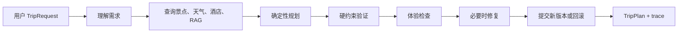
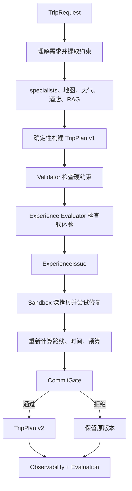

# Agent 工程基础学习指南

本文给第一次深入阅读本项目的开发者使用。默认你会 Python 和 Pydantic，但还不熟悉 Agent、LLM 工程、事务、版本控制和分布式系统。

## 先给结论：这个项目到底在做什么

它不是“让模型写一篇旅游攻略”，而是把一次旅行计划拆成几种不同性质的工作：

1. 用模型和工具理解用户需求、查询候选信息、检查行程体验。
2. 用普通程序计算每天去哪、怎么走、要花多少钱、是否超时。
3. 用 Validator 检查硬约束。
4. 如果有问题，先在副本上尝试修复；通过检查后才提交为新版本。
5. 用 trace、evaluation 和 metrics 记录“为什么这样决定”。

最重要的一条边界是：**LLM 可以建议，确定性程序才可以计算和提交。**

## 如何阅读本指南

每个主题都按下面的问题回答：

| 问题 | 你需要理解的内容 |
|---|---|
| 这是什么？ | 基础概念和最小例子 |
| 解决什么问题？ | 为什么普通代码或一个 Prompt 不够 |
| 传统软件里对应什么？ | 把新概念连接到你已经熟悉的工程概念 |
| 项目在哪里用？ | 真实文件、类和函数 |
| 没有它会怎样？ | 具体故障，而不是抽象口号 |
| 面试怎么解释？ | 可以直接组织成答案的表达 |

---

## 第一部分：理解 Agent 系统和传统软件的区别

### 1. 什么是普通程序、ML 模型和 Agent

普通程序通常是：

```text
输入 → 固定代码逻辑 → 输出
```

例如：

```python
if walking_km > limit:
    return "不通过"
```

规则、分支和结果都由程序员预先写好。

机器学习模型更像：

```text
输入 → 模型推理 → 输出
```

模型根据训练得到的参数生成结果，但它通常不会自己保存业务状态、调用多个外部系统、重试失败操作或提交版本。

Agent 是一个带有“行动循环”的软件系统：

```text
感知输入
  ↓
理解和推理
  ↓
制定下一步动作
  ↓
调用工具或程序
  ↓
观察结果
  ↓
验证、修正、继续或结束
```

因此 Agent 不等于 `LLM + Prompt`。一个可工作的 Agent 至少要处理：

- 状态：现在已经知道什么，当前计划是哪一版。
- 工具：如何查询地图、天气、酒店或知识库。
- 规划：下一步做什么，或者怎样把候选分配到每天。
- 验证：工具返回的结果和模型建议是否满足规则。
- 反馈循环：失败后重试、降级或修复。
- 评估：这次运行是否真的满足要求，而不只是文本看起来通顺。

### 2. 本项目中的 Agent 不是一个“大脑”，而是一条流水线



真实代码入口是 `app/api/routes/trip.py:plan_trip()`。默认配置 `workflow_mode="legacy"` 时调用 `MultiAgentOrchestrator.plan_trip()`；设置为 `langgraph` 时调用 `LangGraphTripWorkflow.run()`。两条路径最后都会复用 `MultiAgentTripPlanner` 的确定性规划核心。

以“带父母去杭州三天，不爬山，每天少走路，必须去西湖”为例：

- LLM 可以从自由文本中识别“父母”“不爬山”“轻松”等意图。
- 地图或本地候选数据提供景点位置、类别、票价等信息。
- `AttractionScorer` 计算候选分数。
- `SpatialItineraryPlanner` 进行分日和排序。
- `RouteEvaluator`/`_recalculate()` 计算交通和步行时间。
- Validator 判断 5 公里、预算、结束时间、必去景点等硬规则。
- Experience Evaluator 可以指出“某天太空”或“类别太单调”。
- RepairController 只在已有候选中尝试有限修复。

### 3. 为什么需要混合架构

自然语言理解和数值计算是两类不同问题。让同一个 LLM 同时负责二者，会产生两个风险：

1. 它可能正确理解“少走路”，却算错两景点之间的距离。
2. 它可能生成一个结构完整的 JSON，却忘记同步 route、budget、validation 等派生字段。

所以本项目选择混合架构：

| 工作 | 更适合谁 | 项目实现 |
|---|---|---|
| 解释自由文本 | LLM/规则 fallback | `LangGraphTripWorkflow.parse_intent()` |
| 查询外部资料 | Tool/service | `AmapService`、specialist agents、`TravelGuideRAG` |
| 排序、分日、路线 | 确定性算法 | `AttractionScorer`、`SpatialItineraryPlanner`、`RouteEvaluator` |
| 硬约束 | Validator | `ConstraintValidationEngine`、`ConstraintChecker` |
| 软体验 | deterministic gate + 可选 LLM | `ItineraryCompletenessGate`、`PlannerAgent` |
| 失败修复 | 受限 mutation + gate | `RepairController`、`PlanMutationSandbox`、`CommitGate` |

面试表达：**Agent 的核心不是“用了多少模型”，而是把不确定的理解能力和必须可靠的执行能力分开。**

---

## 第二部分：LLM 在系统中的正确位置

### 4. 为什么 LLM 不应该承担所有逻辑

LLM 擅长：

- 语言理解和信息抽取。
- 模糊偏好的解释。
- 对“节奏是否舒服”“是否适合父母”做语义判断。
- 从资料中总结建议。

LLM 不适合单独保证：

- 精确算术。
- 路线和时间窗口的一致性。
- 预算上限。
- 每日步行上限。
- 结果可重复性。
- 复杂对象的所有字段同步更新。

这不是说 LLM 没有能力，而是说它的输出天然是概率性的；硬约束需要可重复、可测试、可审计。

项目中的职责分工如下：

```text
LLM：理解、评价、提出建议
程序：计算、验证、执行、提交
```

具体地，`PlannerAgent.review_plan()` 先让模型产生 `ExperienceEvaluation`；模型输出的 `ExperienceIssue` 只描述“哪里可能有问题、建议什么策略”。它不会直接返回一个新的正式 `TripPlan`。真正的修改由 `RepairController` 和 sandbox 完成。

### 5. 这个概念解决什么原始问题

原始问题是“语言世界”和“状态世界”不一样：

```text
模型说：第二天太空，可以增加一个景点

程序需要知道：
增加哪一个？是否已经去过？会不会超步行？
是否晚于结束时间？预算是否增加？路线是否需要重算？
```

如果直接相信自然语言，程序无法安全执行；如果让模型返回完整计划，模型又必须同时维护大量派生状态。因此项目使用结构化 issue 把两边连接起来。

面试表达：**LLM 的输出是建议协议，不是数据库写入协议。**

---

## 第三部分：不变量（Invariant）

### 6. 什么是不变量

不变量就是：无论系统经历什么正常操作，某些条件都必须保持成立。

传统例子：

- 银行余额不能因为一次失败请求凭空减少。
- 支付成功后订单状态不能同时是“已支付”和“未支付”。
- 数据库外键不能指向不存在的记录。

本项目的计划不变量包括：

- 计划不能超过用户预算。
- 每日步行距离不能超过硬上限。
- 不能重复安排同一个 canonical POI。
- must-visit 景点不能无故消失。
- 不能存在不允许的活动，例如用户明确不要爬山时加入高强度爬山景点。
- repair 失败不能改变正式计划。
- 旧 candidate 不能覆盖已经提交的新版本。

### 7. 项目如何维护不变量

| 不变量 | 主要保护代码 |
|---|---|
| 预算/步行/时间/覆盖 | `ConstraintValidationEngine` 的各类 validator、legacy `ConstraintChecker` |
| POI 不重复 | `POIIdentityResolver.assign_visit_keys()`、`CommitGate` 的 duplicate check |
| 修复不污染正式计划 | `PlanMutationSandbox.execute()` 的 deep copy |
| 旧候选不能覆盖新计划 | `CommitGate.decide()` 的 version check |
| 失败保留 best-effort 诊断 | `MultiAgentTripPlanner._finalize_quality_loop()`、LangGraph `finalize()` |

如果没有这些不变量，系统最危险的地方不是“推荐不够精彩”，而是返回一个看似正常、实际上不可执行的行程。

面试表达：**Agent 的不变量就是安全边界；模型可以改变候选，但不能改变安全边界本身。**

---

## 第四部分：Transaction（事务）思维

### 8. 数据库事务先解决什么问题

数据库事务通常用 ACID 描述：

- Atomicity：要么全部成功，要么全部不生效。
- Consistency：操作前后都满足约束。
- Isolation：一个未完成操作不污染另一个正式状态。
- Durability：提交后结果可以恢复。

Agent repair 虽然不是数据库 SQL 事务，但有相同的业务问题：一次修复可能同时改变 POI、路线、时间、预算和质量分。如果改到一半失败，不能只回滚其中一个字段。

### 9. PlanMutationSandbox 是业务事务

`app/services/plan_mutation_sandbox.py:PlanMutationSandbox.execute()` 的逻辑可以读成：

```text
拿到正式 Plan vN
    ↓
深拷贝 candidate
    ↓
在 candidate 上执行 mutation
    ↓
重新计算路线、预算、时间
    ↓
验证硬约束和体验质量
    ↓
CommitGate 决定
    ├─ 接受：candidate 变成 vN+1
    └─ 拒绝：保留正式 Plan vN
```

为什么不能这样写？

```python
plan.days[1].attractions.append(new_poi)
# 之后才发现超预算，再手动删除
```

因为“删除刚添加的 POI”并不能自动恢复所有派生字段；路线、步行、缓存、trace、primary plan 都可能已经被改过。sandbox 把整个尝试隔离起来。

`PlanDiff` 记录 changed_days、added/removed/moved POI、hotel/route 是否改变和成本/步行/交通变化；它是审计信息，不是回滚实现本身。

面试表达：**Sandbox 不是为了复制对象而复制对象，而是为了让一次 repair 具有原子提交和回滚语义。**

---

## 第五部分：Python 深拷贝和隔离

### 10. 为什么 `candidate = original` 很危险

Python 变量保存的是对象引用：

```python
candidate = original
candidate.days[0].attractions.append(poi)
```

这里没有创建新计划，`candidate` 和 `original` 指向同一个对象。

浅拷贝只复制最外层：

```python
candidate = copy.copy(original)
```

但 `candidate.days` 仍可能和 `original.days` 共用内部对象。对于本项目的结构：

```text
TripPlan
 └─ days
     └─ attractions
         └─ Attraction
```

只复制顶层仍然可能共享 `days`、POI、route segments 和嵌套 list。

所以 sandbox 使用：

```python
candidate = base_plan.model_copy(deep=True)
```

这是 Pydantic 模型的深拷贝，能保留模型类型，同时让嵌套对象独立。`MultiAgentTripPlanner.replan()` 也先深拷贝源计划。

### 11. Copy-on-write 和本项目的关系

Copy-on-write 的思想是“只有真的修改某部分时才复制那部分”，可以减少大对象复制成本。本项目当前没有实现通用 copy-on-write，而是每次 repair 深拷贝整个 `TripPlan`，以换取更简单、更明确的隔离语义。

当计划规模明显增大、深拷贝成为性能瓶颈时，才有必要考虑结构化 immutable plan、persistent data structure 或 copy-on-write；引入前必须保留同样的 rollback 和 version 测试。

---

## 第六部分：Version Control 和状态管理

### 12. 为什么 Agent 计划需要版本

只保存“当前计划”无法回答：

- 哪次修复改变了路线？
- 这次失败是由哪个 issue 引起的？
- 为什么当前版本比上一版预算高？
- 恢复 checkpoint 时当前计划是哪一版？

项目使用轻量版本 lineage：

```text
Plan v1（initial_planner）
    ↓ repair attempt
Plan v2（repair_controller，parent=1）
    ↓ user replan
Plan v3（replan，parent=2）
```

`PlanVersionMetadata` 的关键字段：

- `version`：当前计划版本号。
- `parent_version`：从哪个版本产生。
- `mutation_source`：初始规划、repair、replan 或 resume。
- `mutation_action` / `mutation_reason`：做了什么、为什么做。
- `attempt_id`：关联哪次 repair 尝试。

成功 repair 才增加版本；rollback 不增加版本，因为它没有产生新的正式事实。`TripSessionRepository` 还在 SQLite 中保存会话版本全文，这与 TripPlan 内的轻量 metadata 是两层持久化，不应混为完整 event sourcing。

面试表达：**版本不仅用于回滚，也用于并发控制、调试和决策 lineage。**

---

## 第七部分：Optimistic Concurrency Control

### 13. 什么是乐观并发控制

乐观并发控制假设冲突不一定发生，所以先读取和计算，提交时再检查版本。如果读取时是 v2，提交时已经不是 v2，就拒绝本次提交。

项目中的完整场景：

```text
Repair A 读取 Plan v2，开始修复
Repair B 也读取 Plan v2，并先提交为 v3
Repair A 仍拿旧 candidate 尝试提交
```

`CommitGate.decide(base_version=2, current_version=3, ...)` 返回 `STALE_BASE_PLAN_VERSION`。A 必须被拒绝，因为它没有基于 B 的新状态重新计算；直接覆盖会丢掉 B 的修改，甚至重新引入已经解决的硬约束问题。

当前 `run_quality_loop()` 是串行的，所以这更多是安全协议和未来扩展基础。未来并行 repair 可以：

1. 让每个 candidate 记录 `base_version`。
2. 用数据库 compare-and-swap 只允许一个 candidate 从 vN 提交。
3. 其他 candidate 重新读取新版本、重新计算，或只在 mutation scope 不重叠时合并。
4. 合并后仍必须全量重算和验证，不能只拼接 JSON diff。

面试表达：**版本检查防止旧候选覆盖新事实；它解决的是提交冲突，不是路线合并算法。**

---

## 第八部分：Validation、Testing 和 Evaluation

### 14. 为什么不能只看最终文本

“这份行程看起来不错”不是可测试的断言。至少要分别检查：

- hard constraints：预算、步行、结束时间、必去景点、重复和空白日。
- soft quality：节奏、类别多样性、亲子/适老体验、天气备选。
- regression：修复一个问题时不能破坏另一个问题。

`app/evaluation/harness.py:EvaluationHarness` 对每个 evaluation case 调 planner，再运行独立的 `evaluate_plan()`。它将 constraint criteria 和 quality criteria 分开，最后才组合总结果。

单元测试关注局部行为，例如：

- `tests/test_plan_mutation_sandbox.py`：深拷贝、提交、回滚、stale version。
- `tests/test_context_governance.py`：角色上下文不同、硬约束保留、超预算裁剪。
- `tests/test_generic_constraints.py`：约束提取和 validator。
- `tests/test_spatial_planner.py`：分日、排序、步行/交通估算。

evaluation 关注整条链路，`scripts/run_evaluation.py` 支持 deterministic、legacy、langgraph 和 offline/live services。Offline 模式清空地图/embedding key 并使用本地 fallback，适合稳定回归；live 模式更接近真实服务，但会受到外部服务和模型变化影响。

面试表达：**Agent 需要同时有单元测试和行为评估；前者验证组件，后者验证系统结果。**

---

## 第九部分：规则系统和 LLM Judge 的区别

### 15. 哪些问题适合规则

规则适合有明确真值的问题：

```text
daily_walking_distance_km <= max_daily_walk_km
budget.total <= budget_limit
required POI exists
visit keys are unique
planned_end_time <= daily_end_time
```

项目中由 `ConstraintValidationEngine` 的 `TimeValidator`、`WalkingValidator`、`TransportValidator`、`ActivityValidator`、`BudgetValidator` 和 `CoverageValidator` 处理。legacy `ConstraintChecker` 仍提供兼容报告。

优点是精确、可重复、容易写测试；缺点是难以表达“节奏舒服”“亮点不足”这种开放语义。

### 16. 哪些问题适合 LLM Judge

LLM evaluator 更适合：

- 行程是否过于单调。
- 类别是否缺少变化。
- 亲子/适老体验是否合理。
- 雨天备选是否充分。
- 是否符合用户的软偏好。

项目中 `PlannerAgent` 可返回 `ExperienceEvaluation`，再由 `ItineraryCompletenessGate.merge()` 与 deterministic evaluation 合并。LLM issue 仍然要经过 schema、registry、sandbox、validator 和 CommitGate；它不能把硬约束判断改成“我觉得可以”。

面试表达：**规则判断可验证事实，LLM 判断开放语义；两者互补而不是互相替代。**

---

## 第十部分：Structured Output 原理

### 17. 从自然语言到可执行协议

自然语言：

```text
我觉得第二天安排得太空了，可以丰富一点。
```

程序无法稳定知道：哪一天、问题严重程度、应该做什么、改动范围是什么。

项目使用 Pydantic `ExperienceIssue`：

```json
{
  "issue_type": "underfilled_day",
  "severity": "warning",
  "day": 2,
  "evidence": "第二天只有一个短时景点",
  "repair_strategy": "ADD_NEARBY_COMPLEMENTARY_POI"
}
```

结构化输出提供四层价值：

1. schema：字段和类型明确。
2. parsing：`parse_agent_result()` 把模型响应转为 Pydantic 对象。
3. routing：`repair_strategy` 能找到具体 handler。
4. error handling：非法 strategy 变为 contract error，而不是静默执行。

它仍不保证语义正确。例如模型可以合法输出 `day=2`，但候选根本不在第 2 天可用；所以 registry applicability、candidate 检查、重算和 validator 仍不可省略。

---

## 第十一部分：Context Window 和 Context Engineering

### 18. 为什么不能把所有信息都塞给模型

模型输入长度有限，输入越长不一定越好。完整 `TripPlan`、候选池、地图原始响应、repair 历史和 checkpoint 中有大量与当前任务无关的信息，可能造成：

- token 成本增加。
- latency 增加。
- 重要硬约束被噪声淹没。
- 模型注意力分散。

Context Engineering 研究的是：给谁、在什么时候、以什么结构给哪些信息。

`RoleContextBuilder` 用 `ContextPolicy` 为三个角色生成不同视图：

| 角色 | 必要信息 | 可选信息 | 禁止信息 |
|---|---|---|---|
| Experience Evaluator | request、hard constraints、plan summary、validation | weather、少量 candidates、evidence、repair history | raw map、full candidate pool、checkpoint |
| Repair Strategist | request、hard constraints、plan summary、issue、skill options | local candidates、metrics、repair history | raw map、full pool、full attempts |
| Final Explainer | request、plan summary、validation | warnings、weather、evidence | candidates、repair history、full attempts |

代码没有名为 L0/L1/L2 的 enum；可以把 required 理解为 L0，optional 理解为 L1，forbidden/外置 artifact 理解为 L2。超预算时 `RoleContextBuilder.build()` 优先移除可选 section；如果 required 本身超预算，记录 `required_context_over_budget`，不会粗暴截断 JSON。

当前 `enable_context_governance` 默认开启。关闭时 `PlannerAgent` 使用 legacy 全量 review payload，正好可用于治理 A/B 对比。`ContextTrace` 记录 included、omitted、truncated 和 estimated tokens；provider actual input tokens 当前尚未接入。

---

## 第十二部分：Token、Latency 和 Cost

一次 LLM 调用的成本通常受这些因素影响：

- 输入 token 数。
- 输出 token 数。
- 模型价格。
- 调用次数。
- 重试次数。
- 并发和网络等待造成的 latency。

本项目中，三个 specialist 可以并发运行，减少总等待时间；`PlannerAgent` 软审查和 quality loop 可能增加调用次数；Context Governance 通过删除低相关信息减少输入 token。

`TokenEstimator` 用 JSON 字符长度做稳定近似，适合比较“裁剪前后”；它不是 provider 的真实 tokenizer，也不是账单。`ContextTrace.actual_input_tokens` 是预留字段，目前没有从 LLM provider 写回实际值。

面试表达：**Context Governance 同时优化成本、延迟和判断质量；但 estimated token 必须和 provider usage 区分。**

---

## 第十三部分：RAG 基础

### 19. RAG 解决什么问题

RAG（Retrieval-Augmented Generation）把外部资料放进模型上下文：

```text
用户问题
  ↓
检索相关文档
  ↓
把证据放进上下文
  ↓
模型总结或评价
```

它适合补充模型可能不知道、或需要本地资料支持的内容，例如杭州攻略、雨天替代、适老建议和旅行经验。

本项目 `app/services/rag_service.py:TravelGuideRAG` 读取 `app/data/travel_guides/*.md`。有 embedding 时做向量相似度检索；embedding 不可用时使用 keyword fallback。当前代码没有 BM25，也没有完整的 hybrid dense + BM25 检索器。

RAG 只提供 `EvidenceSource`，进入 `MultiAgentTripPlanner` 的 suggestions/review/context；它不直接决定路线。原因是文档可能过期，也不一定包含实时距离、开放时间、价格或交通约束。最终路线仍要经过 map data、确定性 planner 和 validator。

---

## 第十四部分：Tool Calling 和 MCP

### 20. Tool 是什么

Tool 是 Agent 可以调用的外部能力，例如地图搜索、路线查询、天气查询和酒店搜索。它把“模型不会自己知道/计算的数据”交给专门服务。

本项目当前不是 MCP 架构：

- `app/tools/amap_tools.py` 定义 `AttractionSearchTool`、`WeatherQueryTool`、`HotelSearchTool`。
- 它们调用 `app/services/amap_service.py:AmapService`。
- specialist agents 将结果解析为 `AttractionSearchResult`、`WeatherQueryResult`、`HotelSearchResult`。
- AMap 不可用时有本地候选或路线估算 fallback。

未来 MCP 的价值是统一 tool schema、provider 解耦、tool discovery、timeout/retry、调用 trace 和 fallback。但 MCP 只是“怎么调用外部能力”的协议，不应替代 `SpatialItineraryPlanner`、Validator 或 CommitGate。

面试表达：**Tool 提供事实和能力，Planner 决定如何组合，Validator 决定是否合规。**

---

## 第十五部分：Observability

### 21. 为什么普通日志不够

普通日志只能告诉你“某函数报错了”。Agent 系统还要回答：

- 哪次 run？
- 使用了哪个计划版本？
- 哪些候选被选中或拒绝？
- 分数由什么组成？
- 哪个 issue 触发了 repair？
- 为什么 rollback？
- LLM 看到了哪些 context？

`app/services/planning_observability.py:build_planning_trace()` 构建 `PlanningRunTrace`，包含 `run_id`、用户要求、候选分数和拒绝原因、路线、验证、质量 gate 和 context traces。sandbox 的 `RepairAttempt` 记录 attempt、base version、diff、前后质量和 rollback reason；`RepairSkillExecution` 记录 skill 级事件。

Log、metric、trace 的区别：

| 类型 | 适合记录 |
|---|---|
| log | 一次错误的详细原因 |
| metric | commit rate、latency、token 总量等聚合数值 |
| trace | 一次 run 从入口到工具、规划、验证、repair 的因果链 |
| artifact | 完整评估报告、候选证据或计划快照 |

当前有 structured JSON trace，但没有接入 OpenTelemetry、Prometheus、Grafana 或其他 telemetry backend。

---

## 第十六部分：Evaluation-Driven Development

### 22. 为什么 Agent 要靠评估驱动

Prompt、模型、RAG 文档和工具 fallback 的小变化，都可能影响结果。只看手工体验无法知道是否回归。

`EvaluationHarness` 的思路是：

```text
固定 case
  ↓
运行 planner
  ↓
独立计算约束和质量指标
  ↓
输出 pass/fail、metrics、latency
```

当前评估覆盖预算、步行、结束时间、must-visit、避免爬山、低交通、轻松节奏、类别多样性、偏好匹配、重复、地标覆盖和 portfolio 指标。hard constraint 与 quality criterion 分开统计。

`scripts/run_evaluation.py` 支持：

- deterministic：最稳定的离线基线。
- legacy：默认 API 的多 Agent 编排。
- langgraph：带 state/checkpoint 的工作流。
- offline services：用 fallback，不依赖外部 key。
- live services：使用配置的地图、embedding、LLM。

评估集也可能过拟合，因此未来需要独立 holdout、回放测试和避免测试集污染。

---

## 第十七部分：完整学习路线

### Level 0：Python、Pydantic 和引用

学习目标：理解对象引用、深拷贝、Pydantic validation、`model_dump()` 和 `model_validate()`。

建议文件：`app/models/schemas.py`、`app/models/quality.py`、`app/services/plan_mutation_sandbox.py`。

建议测试：`test_plan_mutation_sandbox.py`。

学完要能回答：为什么 `model_copy(deep=True)` 是必要的？为什么 state 中保存 dict 后还要 `TripPlan.model_validate()`？

### Level 1：传统软件工程

学习目标：理解状态、不变量、事务、版本、乐观并发和测试。

建议文件：`app/services/plan_mutation_sandbox.py`、`app/repositories/trip_session_repository.py`、`app/workflows/planning_state.py`。

建议测试：sandbox、conversation、LangGraph workflow tests。

学完要能回答：为什么 rollback 不增加版本？为什么 stale candidate 必须拒绝？

### Level 2：LLM Engineering

学习目标：理解 Prompt、Structured Output、RAG、Tool Calling、token 和 latency。

建议文件：`app/agents/planner_agent.py`、`app/agents/agent_utils.py`、`app/services/rag_service.py`、`app/tools/amap_tools.py`。

建议测试：`test_rag_service.py`、`test_specialist_agents.py`、`test_context_governance.py`。

学完要能回答：为什么模型输出 issue 而不是完整 TripPlan？为什么 RAG 不直接排路线？

### Level 3：Agent Architecture

学习目标：理解 planning、validation、reflection、repair loop 和 state graph。

建议文件：`app/agents/multi_agent_orchestrator.py`、`app/agents/trip_planner_agent.py`、`app/workflows/langgraph_trip_workflow.py`、`app/services/repair_controller.py`。

建议测试：`test_multi_agent_orchestrator.py`、`test_quality_gate_repair.py`、`test_langgraph_trip_workflow.py`。

学完要能回答：哪些步骤是 LLM，哪些步骤是算法？repair 如何避免破坏原计划？

### Level 4：Production Agent

学习目标：理解 observability、context governance、cost、reliability 和 evaluation。

建议文件：`app/services/planning_observability.py`、`app/services/context_governance.py`、`app/evaluation/harness.py`、`scripts/run_evaluation.py`、`app/services/repair_skill_metrics.py`。

建议测试：`test_planning_observability.py`、`test_evaluation_harness.py`、`test_repair_skills.py`。

学完要能回答：如何定位一次失败？如何证明 context 裁剪有价值？JSONL 何时需要换 SQLite 或 telemetry？

---

## 第十八部分：面试回答模板

### 30 秒版本

“这个项目是混合式旅游 Agent。LLM 负责理解自由文本、查询结果的结构化处理和体验审查；确定性算法负责景点评分、空间分日、路线、预算和硬约束验证。修复不会直接改正式 `TripPlan`，而是由 `RepairController` 在 `PlanMutationSandbox` 的深拷贝 candidate 上执行，经过重算、验证和 `CommitGate` 后才生成新版本。LangGraph 负责可恢复的流程编排，Observability 和 Evaluation 负责解释和回归。”

### 3 分钟版本的常见问题

**为什么不用一个大 Prompt 生成完整行程？**

因为完整计划不仅是文字，还包含路线、步行、预算、时间、POI identity 等派生状态。LLM 可以理解偏好，但不适合独立保证这些数值和字段的一致性，所以项目让模型输出 `ExperienceIssue`，让确定性 handler 执行修复。

**为什么需要 Validator？**

Validator 判断预算、步行、结束时间、must-visit、重复和空白日等可计算事实。这些结果需要可重复和可审计，不能由“模型觉得合理”决定。

**为什么 Sandbox 不是多余的一层？**

因为失败 repair 不能污染正式 state。sandbox 深拷贝计划，在 candidate 上 mutation、重算、验证和质量比较；拒绝时直接保留原版本，避免手工撤销遗漏派生字段。

**为什么 CommitGate 要唯一？**

如果 handler、evaluator、LangGraph 节点都能自行提交，系统会出现多个不一致的 acceptance 标准。`CommitGate` 统一检查 stale version、新硬违例、重复、目标 issue 是否改善和软质量回退。

**为什么要版本？**

版本把计划变更变成 lineage，支持调试、checkpoint/resume 和 optimistic concurrency。v2 candidate 不能覆盖已经提交的 v3。

**为什么需要 Context Governance？**

不同 LLM 节点需要不同信息。体验检查不需要完整地图响应，最终说明不需要 repair history；裁剪能降低噪声和成本，同时保证 hard constraints 作为 required context 保留。

**如何处理外部服务失败？**

AMap、天气、LLM 都有 fallback 或 degraded 语义。已完成的 deterministic plan 不会因为可选 LLM review 失败而被丢弃；repair handler/重算失败则 candidate rollback，正式计划保留。

**如何评价系统是否可靠？**

不能只看文本是否自然。用 `EvaluationHarness` 分开测 hard constraint pass、soft quality、latency 和 portfolio；用 unit tests 检查局部不变量，用 offline/live 两种模式区分可重复回归和真实服务效果。

**当前最大限制是什么？**

legacy 是 API 默认路径；通用 validator 和 legacy checker 并存；Repair Skill JSONL 没有幂等/锁/索引；Context Governance 的实际 provider token 尚未采集；MCP、自动 skill evolution、并行 repair、telemetry backend 和长期记忆都尚未实现。

---

## 最后：读完后应该能画出这张图



如果你能解释这张图中每个箭头的输入、输出、失败方式和保护的不变量，就已经掌握了这个项目最重要的 Agent 工程基础。
