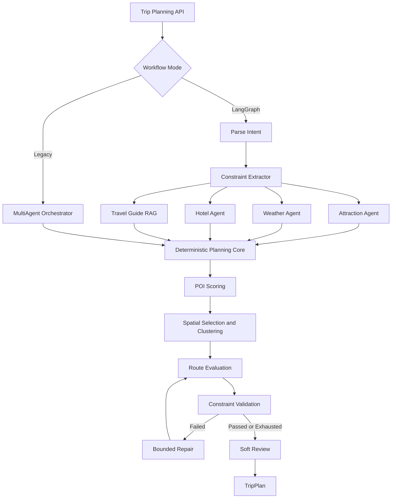

# Travel Planning Agent: Observability, Evaluation, and Optimization

> Engineering Design Report · AI Engineer Portfolio Project  
> 最终验证：7/7 evaluation scenarios passed，98/98 automated tests passed

## Executive Summary

本项目将一个“能够生成旅行计划”的多 Agent 应用，升级为一个**可解释、可评测、可迭代优化**的工程系统。

原系统已经具备景点、天气、酒店、RAG、路线和约束处理能力，但缺少两个关键闭环：

1. 无法系统回答“Agent 为什么选择这条行程？”
2. 无法用稳定、自动化的方法判断一次改动是否提升了整体规划质量。

本次工程工作在不推翻现有架构的前提下完成了三层建设：

- 增加 planning-run 级结构化 observability；
- 建立独立于 planner 的 Evaluation Harness；
- 根据 trace 和 evaluation failure 进行三轮局部优化，将通过率从 4/7 提升至 7/7。

核心设计原则是：**LLM 负责理解与软审查，确定性组件负责计算、硬约束和可重复评测。**

---

## 1. Original Problem

旅行规划并不是单纯的文本生成问题。一个可执行 itinerary 需要同时满足：

- 用户显式需求：城市、日期、预算、节奏、必去地点；
- 隐式偏好：美食、博物馆、亲子、自然等；
- 空间可行性：景点距离、跨区移动、每日路线；
- 时间可行性：开放时间、交通时间、每日结束时间；
- 预算可行性：酒店、餐饮、门票和交通总成本；
- 体验质量：类别多样性、偏好覆盖和行程利用率。

初始系统可以输出完整 `TripPlan`，但存在以下工程问题：

- 候选召回、评分、选点、路线和修复之间缺少统一 trace；
- 最终结果包含 score，却无法解释 score 的来源；
- hard constraint、soft preference 和 LLM 建议混在最终输出中；
- 只有零散单元测试，没有覆盖完整用户场景的质量基准；
- planner 自己生成的 `constraint_report` 同时被当成结果和评判依据，存在“系统自己给自己打分”的风险；
- 改动容易修复一个 case、破坏另一个 case，但缺少自动回归信号。

因此，项目目标从“生成旅行计划”升级为：

> 建立从需求理解、候选召回、排名、路线、验证到评测的可观测闭环，并用 evaluation-driven engineering 持续优化 Agent pipeline。

---

## 2. Initial Architecture

系统保留两种 orchestration mode：

- `legacy`：`MultiAgentOrchestrator` 并行运行 specialist Agents；
- `langgraph`：通过状态图、checkpoint 和 bounded repair 管理完整工作流。

当前生产配置使用 LangGraph。



### 2.1 Specialist layer

- Attraction Agent：LLM + 地图工具，失败时回退到确定性 `POICollector`；
- Weather Agent：获取天气与风险；
- Hotel Agent：生成酒店候选；
- RAG：从城市旅行指南中检索本地证据。

### 2.2 Deterministic planning core

`MultiAgentTripPlanner` 负责：

- 候选补全和 POI metadata enrichment；
- preference、popularity、distance、budget、time-fit 和 diversity scoring；
- 按天选点、区域聚类和顺序优化；
- 生成酒店—景点—酒店 route segments；
- 计算每日时长、步行、预算和利用率；
- 执行 bounded constraint repair。

### 2.3 Validation and review

系统保留两套互补检查：

- `ConstraintChecker`：原有综合约束报告；
- `ConstraintValidationEngine`：按时间、步行、交通、活动、预算和覆盖率分派到 typed validators。

最终 hard-constraint pass 必须同时满足两套检查。`PlannerAgent` 的 LLM review 只允许补充 summary 和有依据的 soft warnings，不允许重写确定性行程结构。

---

## 3. Observability Design

### 3.1 Design goal

Observability 的目标不是记录更多字符串日志，而是建立一个能够回答以下问题的数据契约：

> 用户提出了什么要求？系统看到了哪些候选？每个候选为什么得分或被拒绝？最终路线是否可执行？哪些约束通过或失败？

### 3.2 PlanningRunTrace

每次 deterministic、legacy、LangGraph、replan 和 resume 都生成统一的 `PlanningRunTrace`：

```text
PlanningRunTrace
├── run_id / run_type / created_at
├── user_requirement
├── candidate_pois[]
├── route_planning
└── validation_result
```

用户需求记录：

```json
{
  "age_group": "elderly",
  "budget": 1200,
  "duration": 3,
  "location": "北京",
  "preferences": ["historic", "park"],
  "hard_constraints": [],
  "soft_preferences": []
}
```

候选 POI 记录：

```json
{
  "name": "国家博物馆",
  "category": "museum",
  "location": {
    "longitude": 116.451,
    "latitude": 39.953
  },
  "base_score": 84,
  "preference_score": 10,
  "final_score": 78.67,
  "rejection_reason": "not_selected_by_route_planner"
}
```

拒绝原因被明确区分为：

- `planning_constraint_filter`
- `not_selected_by_route_planner`
- `null`：最终入选

Route trace 汇总：

- selected POIs；
- total travel time；
- walking distance；
- daily schedule；
- category distribution。

Validation trace 汇总：

- hard constraint pass；
- typed violations；
- deterministic reviewer warnings；
- risk warnings。

### 3.3 Emission strategy

Trace 同时通过两种方式提供：

1. 附加到 `TripPlan.observability_trace`，便于 API、测试和离线分析消费；
2. 以单行 JSON 写入应用日志，便于后续接入 ELK、OpenTelemetry 或数据仓库。

所有 orchestration mode 使用同一 trace schema，避免 legacy 与 LangGraph 产生两套不可比较的观测数据。

### 3.4 Safety boundary

Observability 不参与规划决策，也不改变 validator 结果。它是旁路诊断层，因此 trace 失败不会被用于“修正”真实结果，避免 observability 反向污染业务逻辑。

---

## 4. Evaluation Harness Design

### 4.1 Why an independent evaluator

如果只检查 `plan.constraint_report.passed`，只能证明 planner 同意自己的结果，不能证明结果符合业务预期。

Evaluation Harness 因此使用独立 criteria 重新计算关键指标：

- walking limit；
- daily end time；
- total budget；
- must-visit coverage；
- avoid hiking；
- average transport time；
- relaxed pace；
- category diversity；
- preference alignment；
- family friendliness。

最终 case pass 需要同时满足：

```text
independent hard constraints
AND independent quality expectations
AND planner hard-constraint result
```

Evaluator 没有调用 planner 内部 validator，也没有放宽 hard constraint。

### 4.2 Dataset

测试集覆盖七类代表性旅行场景：

| Scenario | 主要风险 |
|---|---|
| No preference Beijing | 默认推荐是否均衡 |
| Elderly traveler | 步行、强度、结束时间 |
| Museum lover | 必去地点与偏好覆盖 |
| Food lover | preference-driven recall |
| Family with children | 亲子友好与类别多样性 |
| Tight budget | 全局预算可行性 |
| Relaxed pace | 每日负载和路线时间 |

每个 case 包含：

- `input_request`
- `constraints`
- `quality_expectations`

### 4.3 Reproducibility

CLI 默认关闭地图、embedding 和 LLM 在线服务，使用确定性 fallback：

```bash
python scripts/run_evaluation.py
```

这样 CI 结果不会因网络、供应商数据或模型随机性漂移。需要验证真实 provider 时，可显式运行：

```bash
python scripts/run_evaluation.py --pipeline langgraph --live-services
```

Harness 支持只运行一个 case，便于快速迭代：

```bash
python scripts/run_evaluation.py --case elderly_beijing_trip
```

---

## 5. Failure Analysis

初始基线：

```text
4/7 passed = 57.1%
```

失败集中在三个不同阶段：

| Failure | Trace evidence | Earliest failing stage |
|---|---|---|
| Food preference | 所有候选 `preference_score=0`，无 food/market/shopping 候选 | Candidate generation |
| Family diversity | 候选池有多类 POI，最终只选 historic + park + park | Ranking / spatial selection |
| Tight budget | 预算正确抽取，但酒店成本 2000，最终总额 2547/1200 | Accommodation normalization / budget planning |

分析时采用“最早偏差”原则，而不是只查看最终 failure：

- 如果匹配偏好的候选从未进入候选池，ranking 无法修复；
- 如果候选池足够多样但最终选择重复类别，问题属于 ranking；
- 如果 validator 正确发现超支，则 validator 不是根因，应该回溯成本生成和预算分配。

---

## 6. Root Cause

### 6.1 Food preference

上海离线 fallback 只有六个通用经典 POI，没有任何候选带有 food、market 或 shopping 的可游览属性。

同时，系统为了避免把普通餐厅当成全天景点，会过滤 restaurant、food、小吃等 POI。这个规则是合理的，但候选 metadata 没有区分：

- 普通用餐地点；
- 可以作为游览目的地的商业街、市场和美食文化街区。

因此 preference 在 requirement 层存在，但在 candidate pool 中失效。

### 6.2 Family diversity

候选池已经包含 historic、park、museum、shopping、campus、natural 和 art。

问题发生在区域分天阶段：当已知区域数少于旅行天数时，planner 会从同一区域拆分新的 day seed，但原逻辑只选择该区域分数最高的下一个 POI。经典景点分数使第二个 park 压过未出现的 category，导致最终类别不足。

### 6.3 Tight budget

输入住宿类型为 `budget hotel`，确定性 fallback 原先只识别中文“经济”和“舒适”。英文档位落入默认高价分支，产生 1000 元/晚、两晚共 2000 元的酒店成本。

此外，酒店价格原本只由住宿标签决定，没有根据总预算和天数分配可用住宿额度。Validator 正确拒绝了 2547/1200 的计划，但上游没有生成预算可行的住宿成本。

---

## 7. Fixes Implemented

所有修复均为局部修改，没有引入新服务或重构 pipeline。

### 7.1 Preference-aware candidate metadata

将现有上海 fallback POI“武康路”的类型补全为：

```text
历史街区;商业街;特色市场
```

这使 food/market/shopping preference 能匹配一个真实可游览区域，同时保留“普通餐厅不进入景点池”的边界。

工程迭代中曾尝试直接增加一至两个新候选，但触发空间排序性能回归。该尝试被撤销，最终方案不增加候选数。

### 7.2 Diversity-aware day seeding

当区域数量不足、必须把同一区域拆分到新的一天时：

1. 收集已经作为 day seed 的 category；
2. 优先选择未出现的 category；
3. 再使用原有 must-visit、score、bucket size 和 area 规则打破平局。

这不是强制平均分配类别，而是在有限容量内增加一个稳定、可解释的 diversity preference。

### 7.3 Budget-aware hotel estimation

确定性酒店 fallback 增加：

- 中英文住宿档位规范化；
- `budget`、`economy`、`hostel` → 经济型；
- `comfortable`、`comfort` → 舒适型；
- 有预算时，每晚住宿成本不超过每日预算的 50%，同时保留最低合理估值。

Validator 和 budget limit 没有变化；planner 必须真正生成低于预算的结果才能通过。

---

## 8. Before / After Metrics

### 8.1 Overall

| Metric | Before | After |
|---|---:|---:|
| Passed scenarios | 4/7 | 7/7 |
| Evaluation pass rate | 57.1% | 100% |
| Automated tests | — | 98/98 passed |
| Hard validator changes | 0 | 0 |

### 8.2 Failure-specific

| Scenario | Before | After |
|---|---|---|
| Food lover | 无 preference-aligned POI | `武康路` 命中 food/market/shopping |
| Family | 2 categories：historic + park | 3 categories：campus + historic + park |
| Tight budget | 2547 / 1200，constraint score 0.8 | 1147 / 1200，constraint score 1.0 |

### 8.3 Final evaluation snapshot

| Scenario | Result | Key evidence |
|---|---|---|
| No preference Beijing | Pass | 4 categories，平均交通 90.7 分钟 |
| Elderly Beijing | Pass | 0 km fallback walking，结束时间和强度约束通过 |
| Museum lover | Pass | 国家博物馆保留，偏好命中 |
| Food lover | Pass | 武康路偏好命中，平均交通 80.7 分钟 |
| Family with children | Pass | 3 categories，亲子友好 POI 存在 |
| Tight budget | Pass | 1147 ≤ 1200 |
| Relaxed Hangzhou | Pass | 西湖保留，平均交通 89.7 分钟 |

---

## 9. Remaining Limitations

### 9.1 Dataset coverage

七个场景能够验证核心路径，但仍是小规模 curated benchmark，无法代表：

- 更多城市和跨城市旅行；
- 极端日期、节假日和实时闭馆；
- 多人、多房间、机票等复杂预算；
- 相互冲突或不可满足的自然语言需求；
- 中英文之外的多语言输入。

### 9.2 Offline/live gap

CI 使用确定性 fallback，而线上高德、天气、embedding 和 LLM 输出会变化。7/7 证明固定基准通过，不代表 live provider 下始终达到相同结果。

### 9.3 Route fidelity

离线场景中的 walking distance 多数为 0，说明 fallback route 对真实步行段的建模不足。当前 evaluation 对 walking constraint 的证明在 live route 数据上会更有意义。

### 9.4 Soft violations remain visible

Family case 最终通过独立 evaluation，但 planner constraint score 仍为 0.72；Elderly case 为 0.857。这些分数来自 soft violations，而不是 hard-constraint failure。

系统没有隐藏这些问题，但说明“case pass”不等于 itinerary 已达到最优体验。

### 9.5 Heuristic budget model

住宿预算使用确定性比例，而非真实酒店库存和价格。它适合测试 fallback 和预算边界，但不是商业级定价系统。

### 9.6 Candidate-pool performance

迭代中观察到：给上海 fallback 直接增加多个候选会明显放大空间规划耗时。最终修复避免了该问题，但更大候选池下的 beam search、clustering 和 repair 性能仍需系统 profiling。

### 9.7 Trace granularity

当前 candidate trace 覆盖进入 deterministic planning 的候选，但对更上游的 raw provider results、解析失败项和 POICollector 早期过滤项记录仍不完整。

---

## 10. Future Improvements

### 10.1 Expand evaluation coverage

- 增加 50–100 个版本化场景；
- 加入 adversarial、conflicting 和 infeasible requests；
- 按城市、persona、预算和旅行长度分层统计；
- 加入 ranking NDCG、Recall@K、must-visit recall 和 repair convergence 指标。

### 10.2 Provider replay testing

保存经过脱敏的地图、天气和酒店响应，建立 deterministic replay fixtures，在不访问真实服务的情况下测试 live-shaped data。

### 10.3 Full-stage tracing

将 trace 扩展为：

```text
raw provider results
→ parsing result
→ hard-filtered candidates
→ ranked candidates
→ selected candidates
→ route alternatives
→ repair actions
```

这样可以直接计算每个阶段的 recall loss 和 ranking loss。

### 10.4 Multi-objective optimization

把当前启发式规则升级为显式目标函数：

```text
maximize:
  preference coverage
  + category diversity
  + POI quality

minimize:
  travel time
  + walking
  + budget overrun
  + area switching
```

Hard constraints 始终作为不可违反的 feasibility boundary。

### 10.5 Route performance optimization

- 对候选池做分层剪枝；
- 缓存 pairwise route cost；
- profile `_cluster_by_area` 和 beam expansion；
- 为候选规模设置明确 latency budget；
- 增加 performance regression tests。

### 10.6 Human and LLM evaluation

在 deterministic criteria 之外增加：

- 独立 LLM-as-a-Judge，且 judge 与 generator 使用不同 prompt/model；
- 人工 pairwise itinerary preference；
- warning faithfulness 和 RAG citation correctness；
- 不同用户画像下的满意度评估。

### 10.7 Production monitoring

将 `PlanningRunTrace` 接入 dashboard，持续监控：

- hard-constraint pass rate；
- fallback/degraded-service rate；
- candidate preference coverage；
- route latency；
- repair count；
- budget overrun；
- 按城市和 persona 的质量分布。

---

## Interview Takeaway

这个项目展示的核心能力不是“调用 LLM 生成旅行文案”，而是：

- 把开放式 Agent 行为拆解为可观测 pipeline；
- 用 typed contracts 隔离 LLM 与确定性计算；
- 建立独立、可复现的 evaluation oracle；
- 通过 trace 定位最早失败阶段；
- 使用小范围、可验证、可回滚的工程修改完成优化；
- 在达到 7/7 的同时保留 strict validator 和未解决的 soft-quality 信号。

最终形成的闭环是：

```text
Generate → Trace → Evaluate → Diagnose → Patch → Re-evaluate
```

这也是将 AI prototype 推进到可维护工程系统的关键路径。
